# General

# 沉沦海更新
Triangle披露了大量沉沦海更新中的生物的相关信息
## 概览图(8/20)

### 沙漠
- 风暴蚁狮将会有四种变种，分别对应四种蚁狮变种(8/3)
  
### The shores
- 骸骨制的水母状生物将出现在the shores(8/3)
  
- 螃蟹商人/拾荒者,可用珍珠交换来自已死亡战士的战利品(8/1)
  
### 沉沦海
- 水母是在焚海事件死者的灵魂变的(8/1)
  
- 如果你冒犯遗体或墓碑,水母会被激怒并攻击你(8/1)
  
- 海兔有被动和攻击性两种(8/1)
  
- 三种小鱼分别为:(8/1)
  
- 海蛞蝓重绘(8/3)
  
- 暂时还没有画的几种"大家伙"(8/6)
  
## 大体进展
- 有3把新鞭子,以及摸了(8/14)
  
- 群系生成已经接近完成(8/8)
  
## 更新时间
- 可能今年内都不会出(8/7)
  
  
  (8/8)

# 幽花重做
## 设计
- 二阶段将会是开心脸(8/6)
  
- 盔甲设计基于生锈装甲骷髅(8/6)
  

## 贴图
- 一阶段(8/6)
  
- 一阶段的尾部(8/4)
  
- 二阶段(8/9)
  
  

## 概念艺术
- (8/9)
  

# 硫火崖优化
来自生物群系岩浆的作者Lion8cake(8/5-6)
- 硫火崖的岩浆将得到渐变效果
  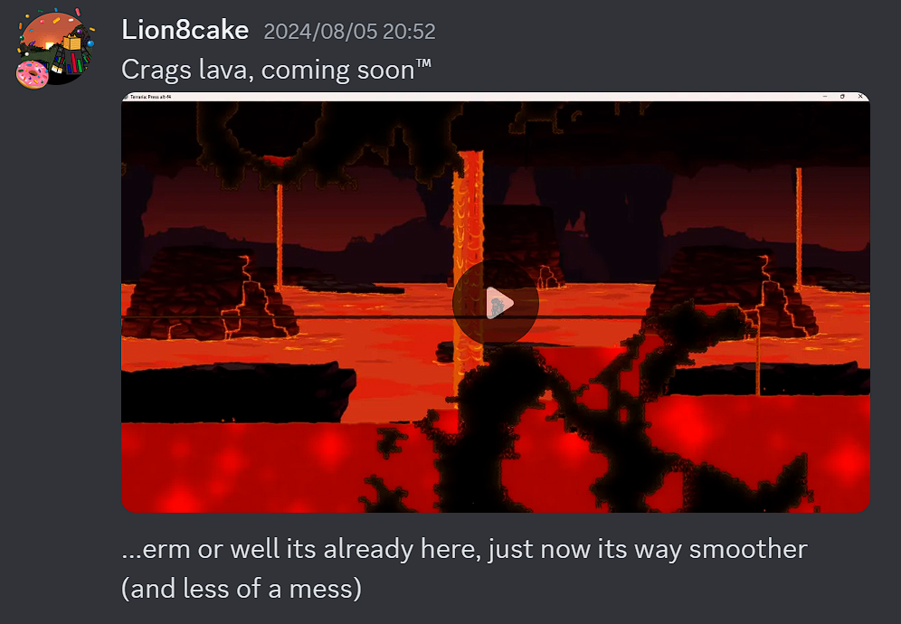<video controls src="../Themed/Others/CragsLava.mp4" title="Title"></video>
- 硫火崖会有岩浆泡,滴落岩浆等的新特效
  

# 荒漠灾虫重绘
- 可能会加入鳍翼,像法环里的狂龙贝勒
  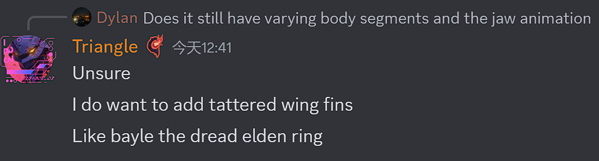
  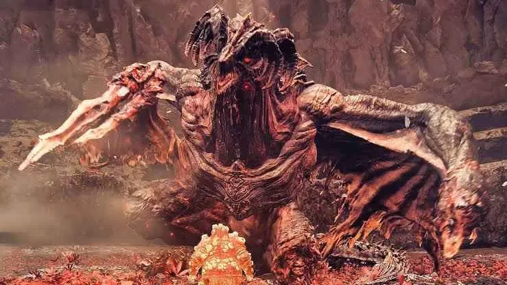
- 黄沙恶虫将不再像灾虫
  
- 嘴部(8/10)
  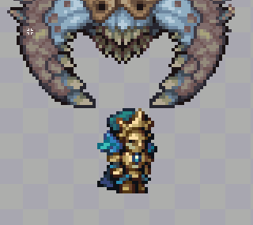
  (8/20)
  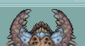
  (8/20)
  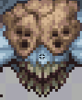
- 轮廓(8/13)
  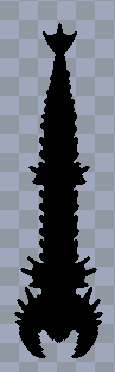
- 将会有一个巢(8/20)
  
- 通过自我复制来繁衍(8/20)
  
- 将会有一个很酷的预告片(8/20)
  

# 神吞新贴图
- 由Heart Plus Up!绘制
- 比现有贴图大得多
- 一阶段脱甲,二阶段穿甲
- 新贴图和新旧贴图对比在站内已经有视频(官号&汝不见鬼)
- 一阶段贴图更新(8/14)
  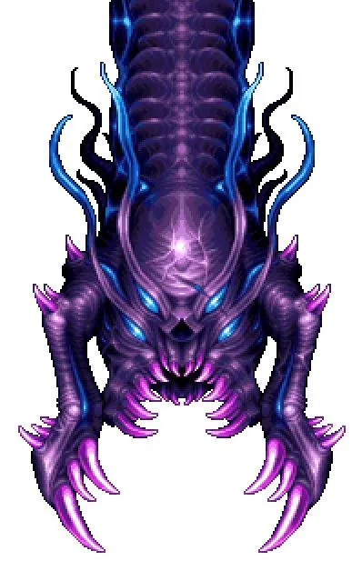

# 军械库
## 武器
- 相位剑会被类似装甲核心6中的月光大剑的新武器取代,原有的来自毁灭战士的攻击方式会被移动到地狱武器上(8/9)*请优化这一段话的表述*
  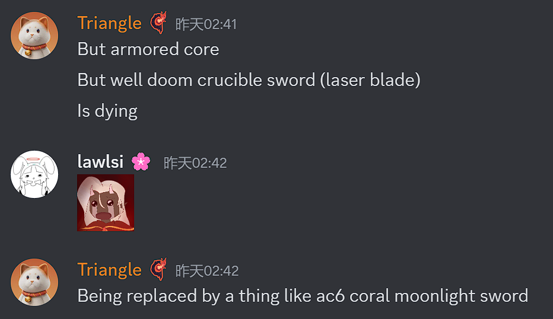
  

# 天蓝系列
## 天蓝套
疑似天蓝套新贴图(8/10)
请自行做阅读理解(我没看懂)
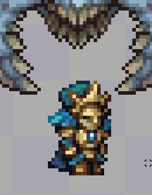
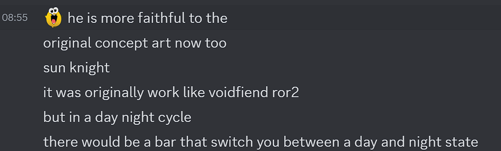
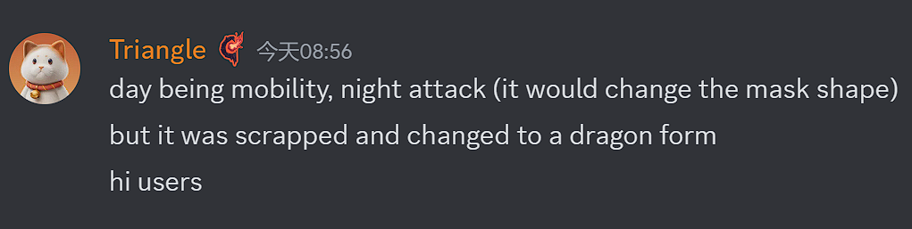
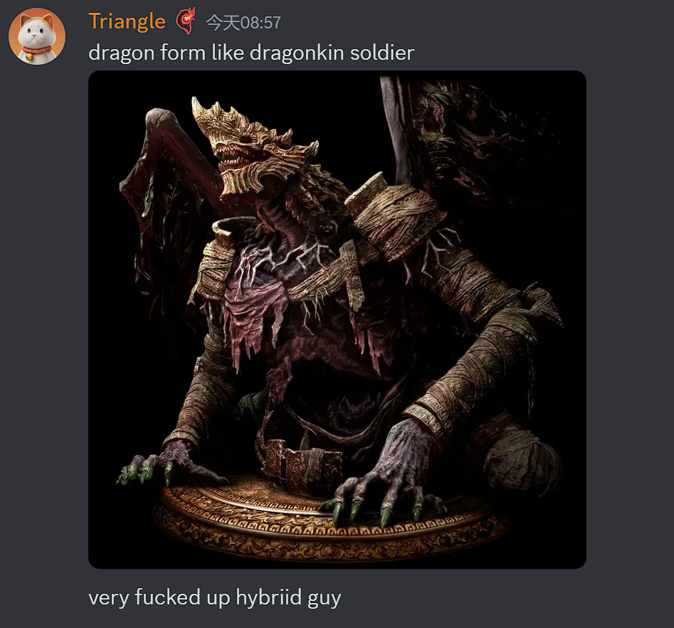
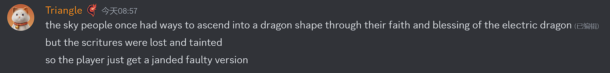

# 纯饼

## 贴图更新
- Triangle计划重新设计老猪(8/7)
  
- 一两个月内就会着手重绘老猪(8/20)
  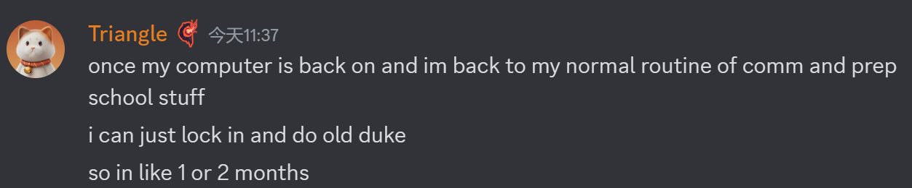
- 他说一周就可能能画完(8/20)
  
- 始源林海套,将不再像席尔瓦那样,而是有点像神(8/7)
  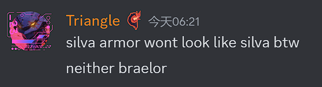
  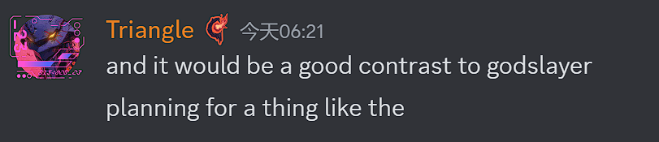
  
  可能像老头环里的GodSkins
  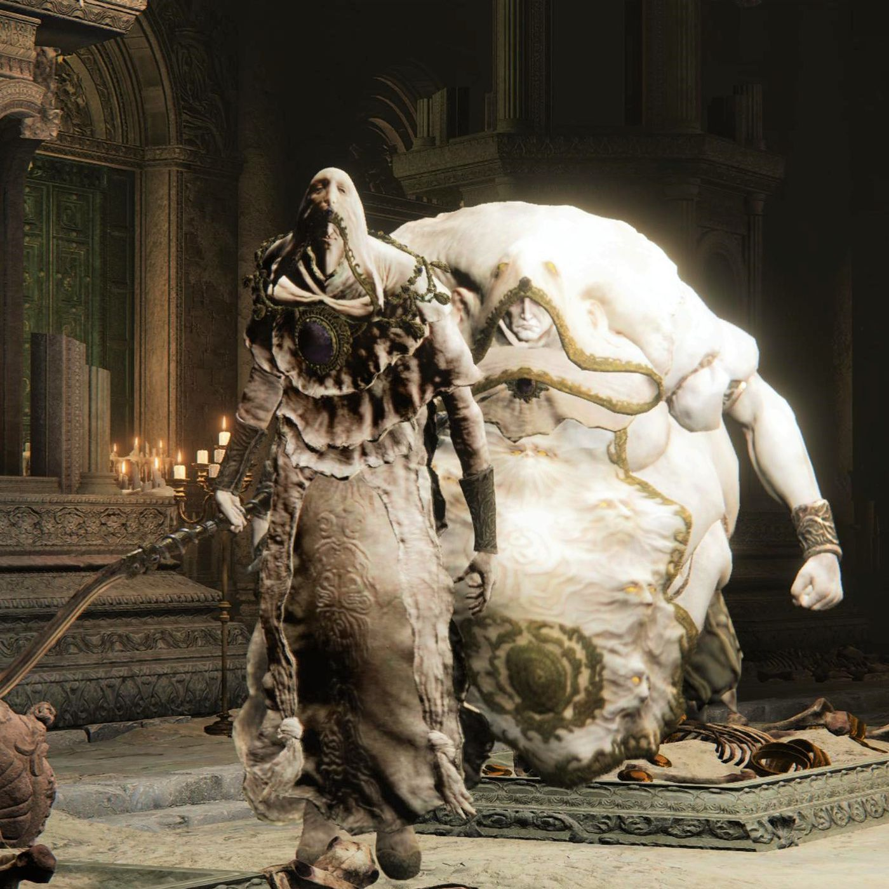
  或者咒术回战的"八握剣異戒神将魔虚羅"
  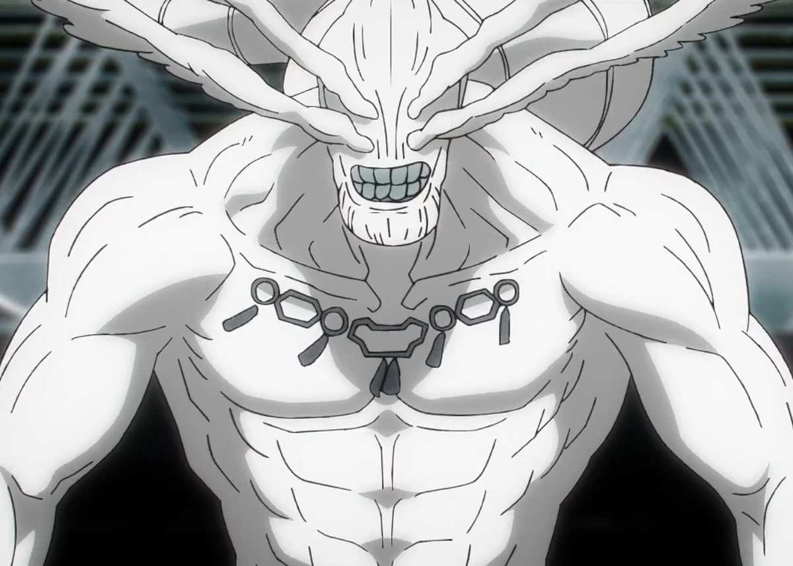
  三角你学点好的吧...