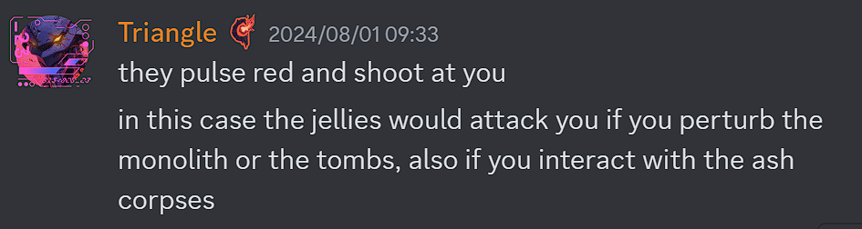
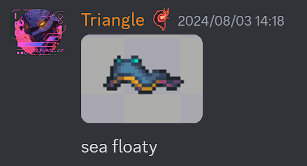

# General

# 沉沦海更新
Triangle披露了大量沉沦海更新中的生物的相关信息
## 概览图

### 沙漠
- 风暴蚁狮将会有四种变种，分别对应四种蚁狮变种
  
### The shores
- 骸骨制的水母状生物将出现在the shores
  
- 螃蟹商人/拾荒者,可用珍珠交换来自已死亡战士的战利品
  
### 沉沦海
- 水母是在焚海事件死者的灵魂变的
  
- 如果你冒犯遗体或墓碑,水母会被激怒并攻击你
  
- 海兔有被动和攻击性两种
  
- 三种小鱼分别为:
  
- 海蛞蝓重绘
  
- 暂时还没有画的几种"大家伙"(8/6)
  
## 更新时间
- 可能今年内都不会出(8/7)
  
  

# 幽花重做
## 设计
- 二阶段将会是开心脸(8/6)
  
- 盔甲设计基于生锈装甲骷髅(8/6)
  

## 贴图
- 一阶段(8/6)
  
- 一阶段的尾部(8/4)
  

## 概念艺术
- 二阶段仍然保密而不是黑块脸,三阶段的头发可能不长这样(8/6)
  

# 硫火崖优化
来自生物群系岩浆的作者Lion8cake(8/5-6)
- 硫火崖的岩浆将得到渐变效果
  <video controls src="../Themed/Others/CragsLava.mp4" title="Title"></video>
- 硫火崖会有岩浆泡,滴落岩浆等的新特效
  

# 纯饼

## 贴图更新
- Triangle计划重新设计老猪(8/7)
  
- 始源林海套,将不再像席尔瓦那样,而是有点像神(8/7)
  
  
  
  可能像老头环里的GodSkins
  
  或者咒术回战的"八握剣異戒神将魔虚羅"
  
  三角你学点好的吧...