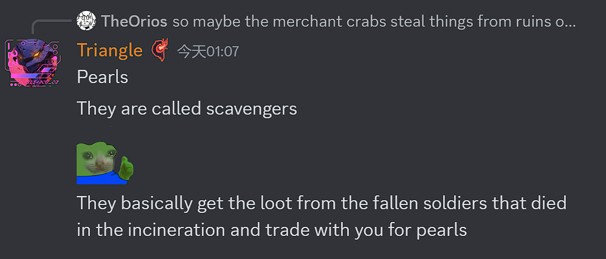
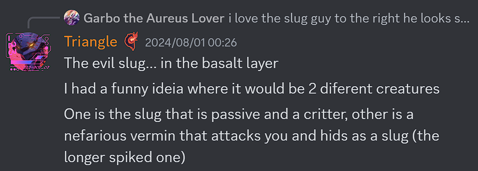
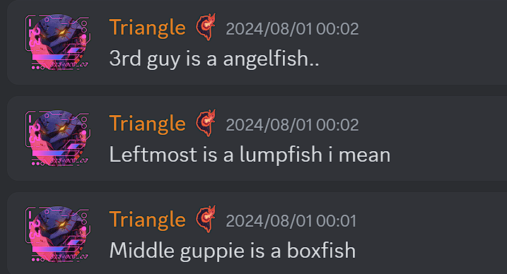

# General

# 沉沦海更新
Triangle披露了大量沉沦海更新中的生物的相关信息
## 概览图

### 沙漠
- 风暴蚁狮将会有四种变种，分别对应四种蚁狮变种
  
### The shores
- 骸骨制的水母状生物将出现在the shores
  
- 螃蟹商人/拾荒者,可用珍珠交换来自已死亡战士的战利品
  
### 沉沦海
- 水母是在焚海事件死者的灵魂变的
  
- 如果你冒犯遗体或墓碑,水母会被激怒并攻击你
  
- 海兔有被动和攻击性两种
  
- 三种小鱼分别为:
  