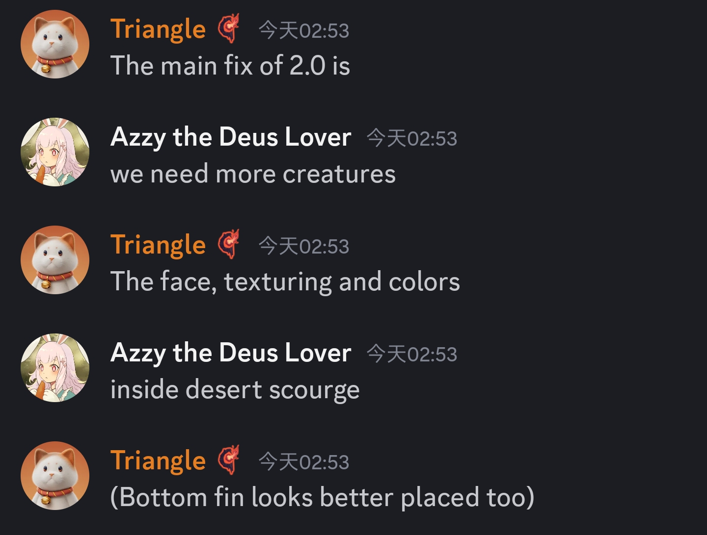
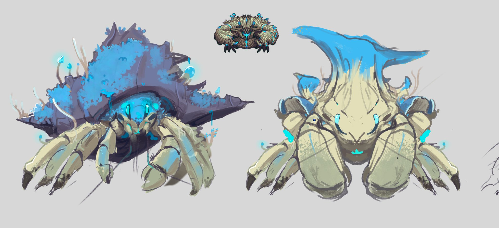
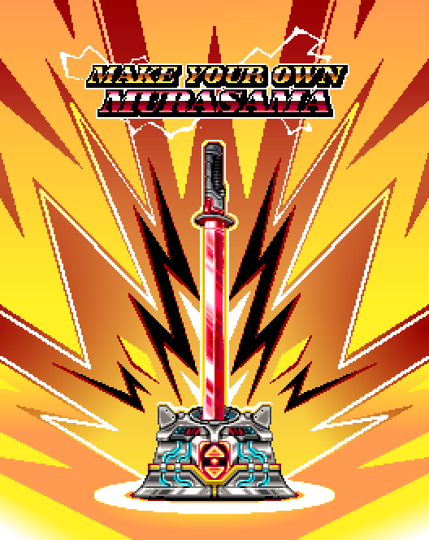
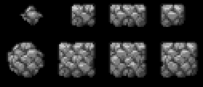
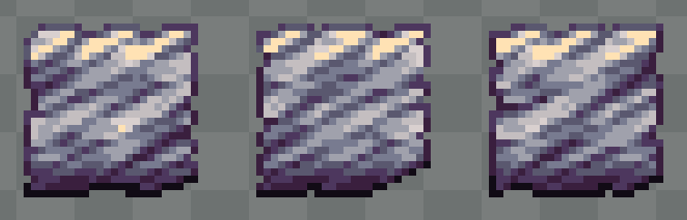
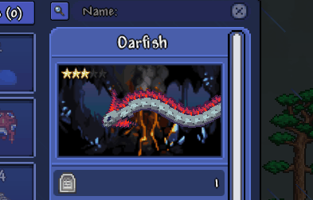
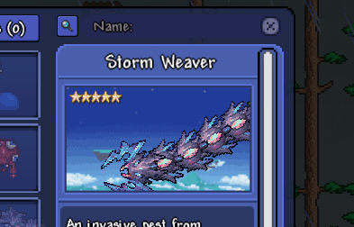
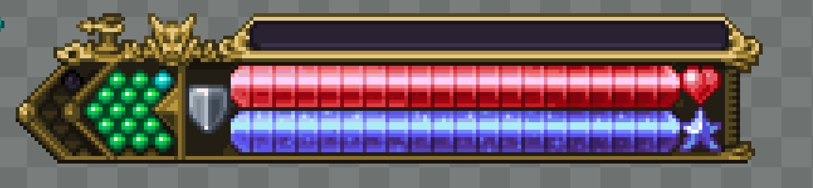
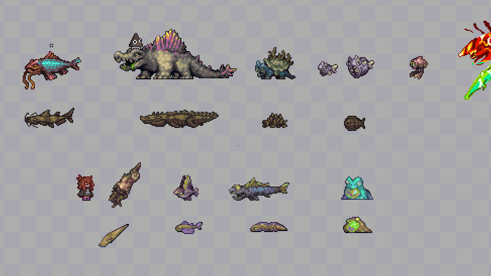

# 荒漠灾虫
- 三角可能会调整荒灾的脸部,质感和颜色(10/1)
  

# 菌生蟹
- Cristian Mihaii绘制的概念图(9/30)
  

# 村正竞赛
- 10月1日,Dia举办鬼妖村正竞赛,前5名作品将被加入游戏,竞赛到11月1日截止
  

# 不知道名字的群系
- 疑似更新(10/1)
  
  
  

# 图鉴
- YuH给生物图鉴中的蠕虫增加了动画(9/27)
  
  

# UI重新设计
- 玩家UI(9/19)
  

# 硫磺海生物
- Triangle的硫磺海生物(9/30)
  
- 天鳍鱼+腐蚀蛙的组合技(10/1)
  