# 荒漠灾虫
- 三角可能会调整荒灾的脸部,质感和颜色(10/1)
  

# 菌生蟹
- Cristian Mihaii绘制的概念图(9/30)
  

# 村正竞赛
- 10月1日,举办鬼妖村正竞赛,前5名作品将被加入游戏,竞赛到11月1日截止
  
- 月末时请一起选几个作品放上来

# 不知道名字的群系
- 疑似更新(10/1)
  
  
  
- Cristian绘制的相关概念图(10/3)
  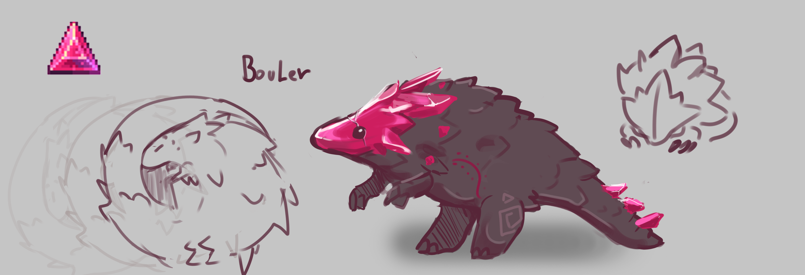
  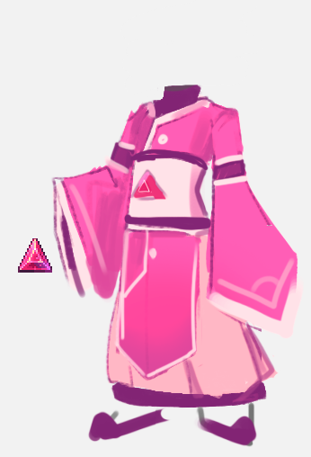

# 史莱姆之神
- 动画师enamoured公布了史莱姆之神的动画(10/18)
  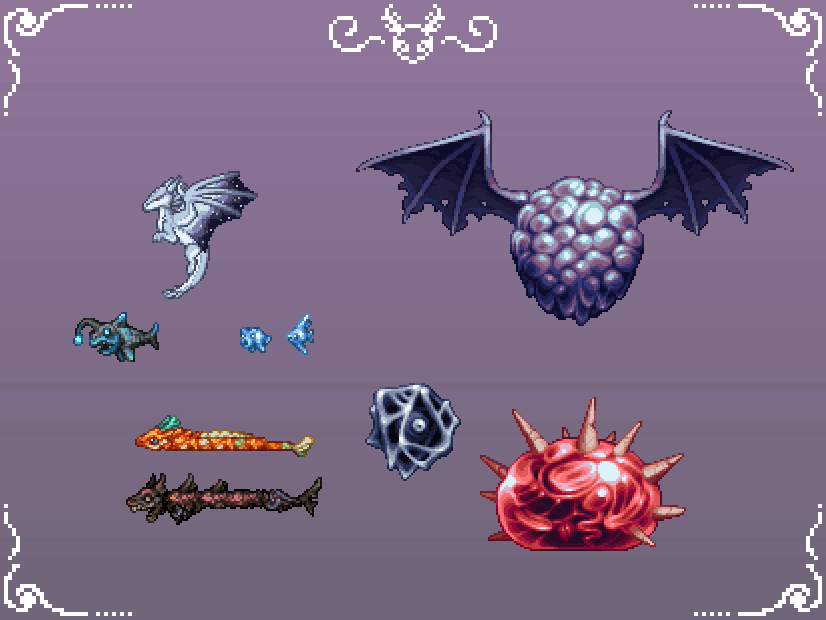
- 圣卫的动画只包括翅膀和刺,身体部分的运动会由代码实现(10/18)
  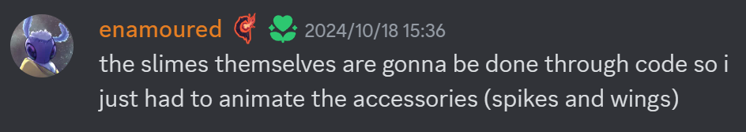
- 圣卫的动画可能会有调整(10/18)
  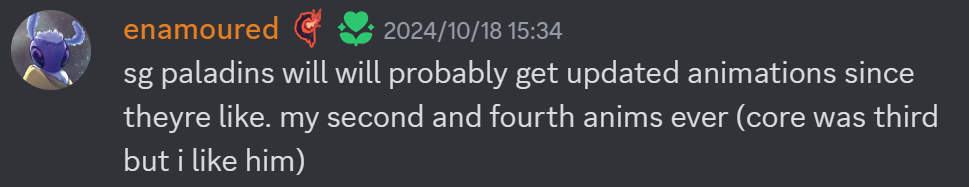

# 噬魂幽花
- Cristian Mihaii绘制的概念图(当然,不一定采用)(10/1)
  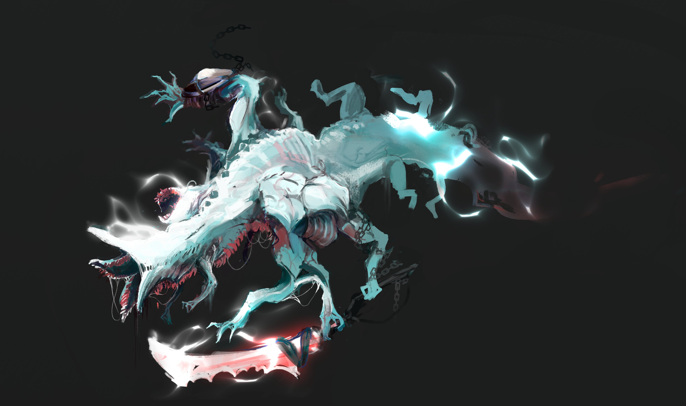

# 图鉴
- YuH给生物图鉴中的蠕虫增加了动画(9/27)
  
  

# UI重新设计
- 玩家UI(9/19)
  

# 武器
- Heart绘星河之刃(10/4)
  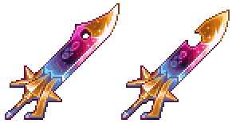
- Xyk正在着手星河之刃,而且以后有可能彻底消灭真近战(10/8)
  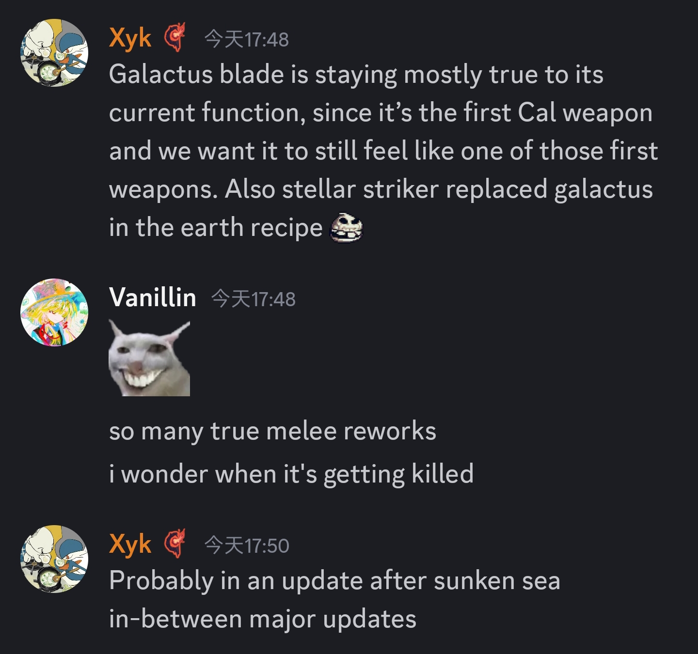
- Cristian Mihaii的碎水霰弹枪概念图(9/29)
  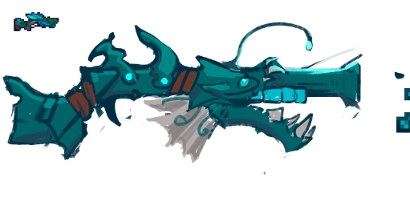
- 目前已知重做列表(由Discord用户整理)(10/9)
  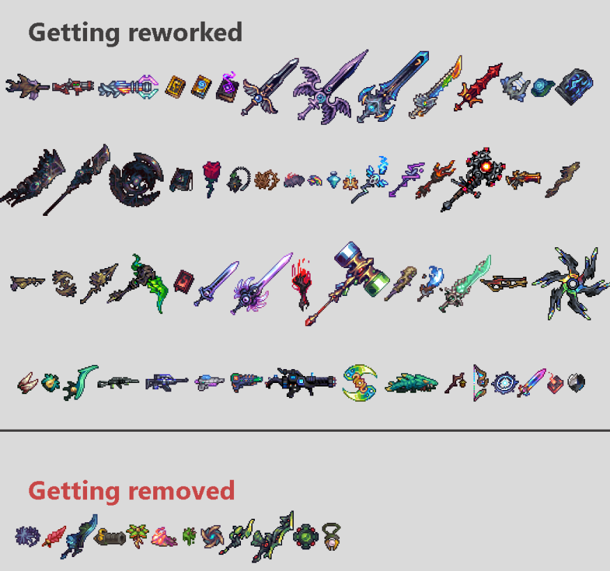
- 新的捐赠者武器,据悉是基于《火翼飞龙》系列(动图左上)(10/18)
  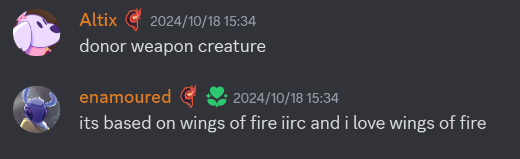
  
- AngelVA公开了硫酸炮的重做(10/19)

# 永恒系列
- 永恒矿将不再是矿物,且会有专门的子群落Floral Paradise(10/13)
  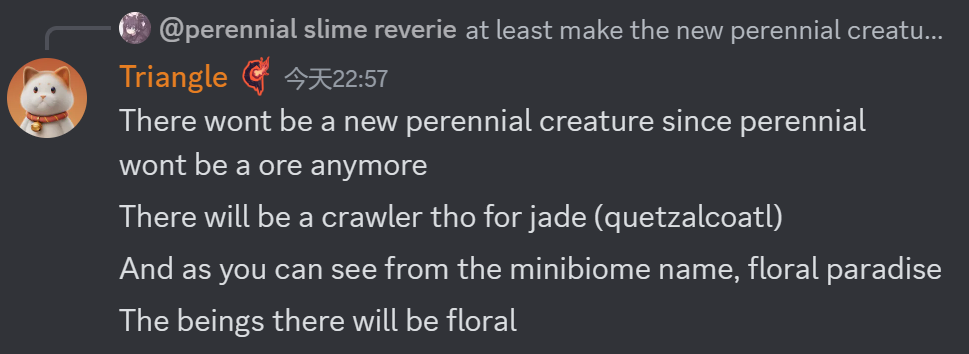
- 这个子群落还会有一种新的树木(10/13)
  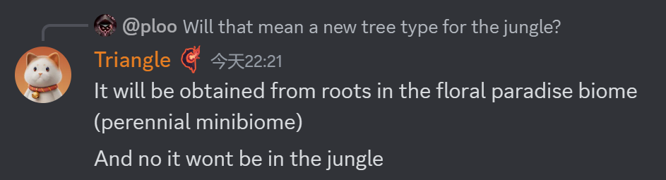
- 掠夺者套将成为一种宝石和木材的混合(10/13)
  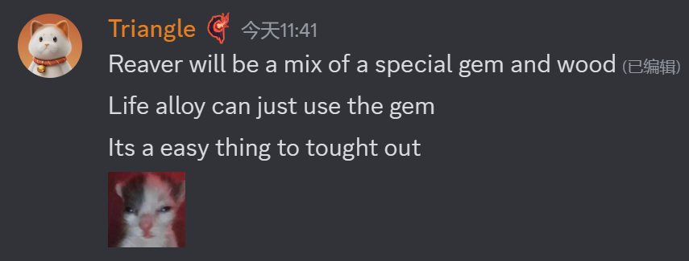

# 未知
- YuH对石约胜利之剑作了未知改动(10/8)
  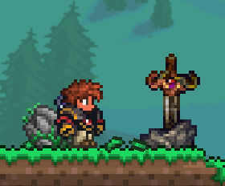

# 硫磺海生物
- 天鳍鱼+腐蚀蛙的组合技(10/1)
  
- 会出现鹦鹉螺作为辅助敌怪,脑子将会成为可见部分(10/2)
  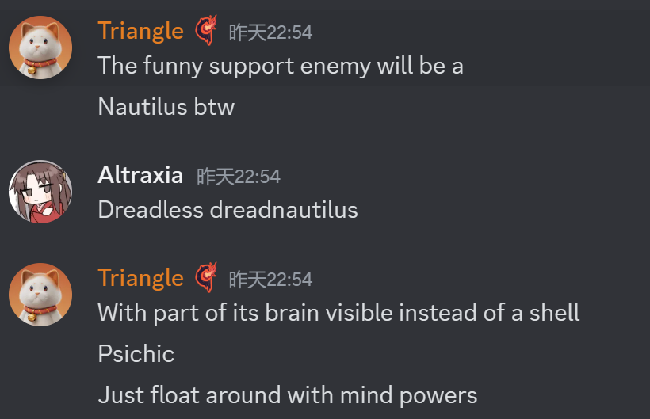
- 渊海灾虫可能是Dandy绘制,或者和三角合作(10/3)
  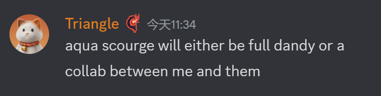
- T1生物的武器(10/3)
  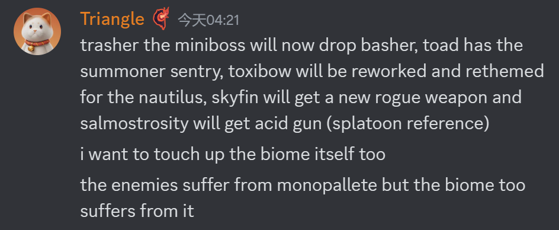
- 包括硫磺猪龙,渊海狂鲨的概念图(10/6)
  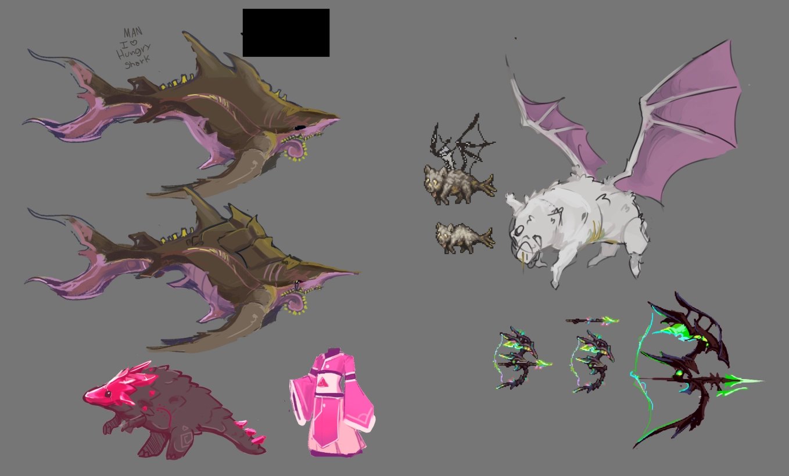
- 酸水鳗(10/7)
  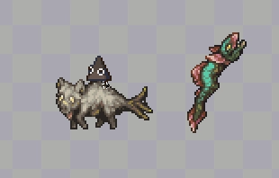
- 高口蟹动图(10/7)
  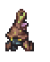
- 酸雨1阶部分小怪(10/6)
  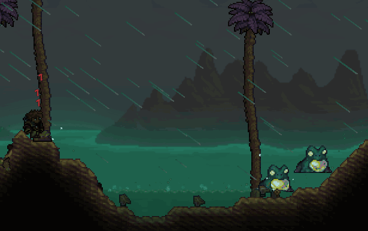
- Discord用户整理的硫磺海生物重绘,其中两种史莱姆by Dia,直角石by Dandy,三叶虫by Triangle& Dandy(10/9)
  
- 剧毒高射炮重绘by Dia(10/9)
  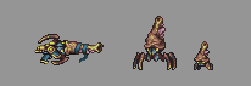
- Triangle计划给所有酸雨迷你Boss都加入大师模式掉落(10/10)
  - 捣碎鳄:坐骑
  - 峭咽潭:史莱姆宠物
  - Beelzebufo:坐骑
  - 渊海狂鲨:宠物(10/12)
  - 辐核骇兽:照明宠物
  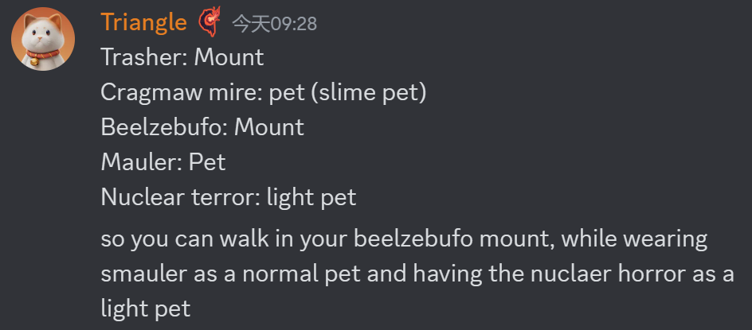
  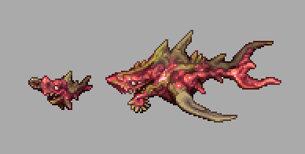

# 硫海遗爵
- Cristian Mihaii绘制的老猪概念图(10/8)
  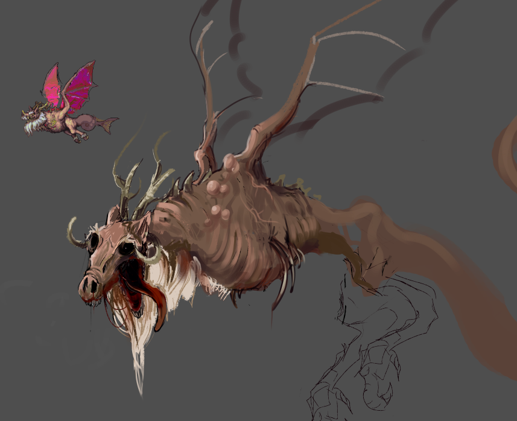
- 三角设定,非官设,老猪曾居住在更冷的地方,并是掌管冷冻的龙,只是因为没有更多的金源魄,才没有成为真正的金源龙,当猎龙开始时,老猪决定冻结整个世界,结束人和神的时代,但是它失败了(10/9)
  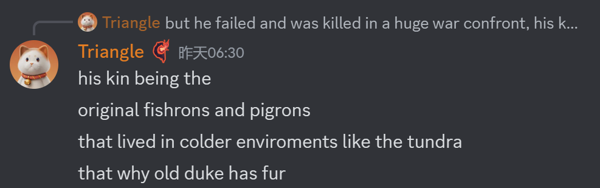
  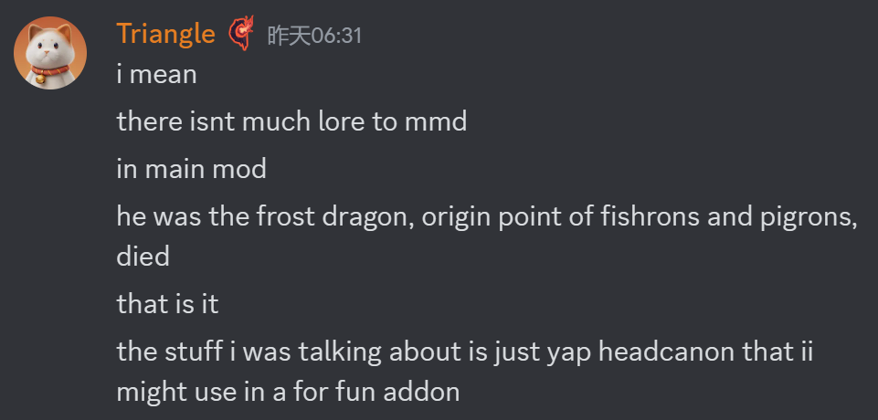
  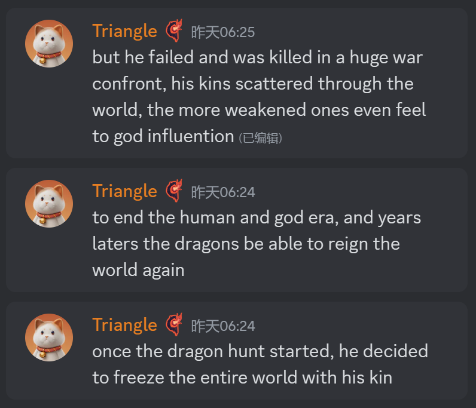

# 沉沦海
- 拾荒蟹(Scavenger)的动画,由Dandy制作(10/19)
  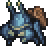
- YuH发布了拾荒蟹的演示视频,可以看到它类似MC的猪灵,是以物易物的机制,而非常规的商人(10/20)
- 动画师enamoured放出了一些沉沦海生物的动画(左下)(10/18)
  

# 海王
- 海王将会随着世界生成在沉沦海的一个神殿中,并需要通过一个支线任务来解锁他作为城镇NPC的功能,类似于服装商(10/21)
  
  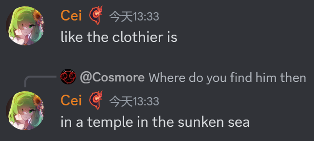

## 酸雨
### 一阶(10/2) ###
- 天鳍鱼:现在能够捡起辐核蟾蜍和酸水鳗加入战斗.被捡起的酸水鳗会从高空中射出射弹,狙击玩家;蟾蜍会被扔向玩家,进行地毯式轰炸
- 辐核蟾蜍:可能提升爆炸范围,造成更多伤害,可能留下滞留辐射圈.能被天鳍鱼捡起
- 酸水鳗: 改名为salmonstrosities(鲑鱼?),会得到彻底重做.三角的建议是让他们尝试跳出水面,吸在岸上的物块,并像炮台一样发射弹幕.如果玩家入水,它们会尝试撞击玩家.能被天鳍鱼捡起
- 辐射海蛞蝓:现有版本改成小动物.新的是一种辅助性地面敌怪,会产生一片强力辐射圈,强化附加敌怪并伤害玩家.
- 捣碎鳄: 现在是一阶酸雨的迷你Boss,在事件接近结束时声称.主要攻击为强力甩尾和螺旋冲刺(参考现实世界中鳄鱼的死亡旋转).它有能力将辐核蟾蜍甩向玩家,并呼唤其他敌怪来帮助他.
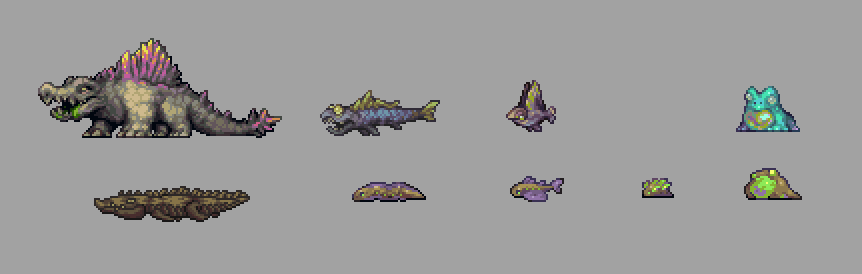

### 二阶(10/3) ###
- 事件变化:雨越下越大了,现在雷暴清晰可见,而且偶尔会落在玩家身上,造成巨大威胁!salmonstrosities和天鳍鱼不再生成,捣碎鳄现在在事件的前40%作为迷你Boss生成,在后期被峭咽潭取代,辐核蟾蜍和鹦鹉螺也在二阶出现 
- Troglobite(原三叶虫): 支援坦克敌怪,会尝试跳入其他敌怪体内,寄生于他们身上,被寄生的敌怪会得到高额防御,以及受击时用刺反击的能力.做出更改的原因是水下敌怪的生态位已经有直角石了,且现在的事件中还没有坦克位.
- 直角石: 水下杀手,会蓄力冲刺,并用它锥形的头部刺穿玩家.如果玩家出水,它会向玩家发射酸性墨水弹,而不是什么都不做. 
- 硫海爬虫: 它的泡泡形态将会有新的移动模式,使它多是空军单位(它在飞行气泡模式下会更清晰).它也能向辐核蟾蜍和直角石发射泡泡,并让它们浮在空中.飞起来的辐核蟾蜍将会是更大的空中威胁,用以针对已经获取了翅膀的玩家.(泡泡直角石还不一定,但三角认为考虑到翅膀的移动力,上述的飞行蟾蜍设计很棒)
- 辐射史莱姆: 主要地面威胁,跳跃时在地上留下飞溅酸液滴,能够伤害玩家,并引爆辐核蟾蜍
- 高口蟹: 主要射弹敌怪,在远处就位并狙击玩家.是高优先度敌人,因为它们一旦聚集起来,将变得很难处理.它存在的主要目的是阻止玩家在事件期间站定不动,并保持玩家高度警惕(它和雨中冒险2中的螃蟹定位类似)
- 峭咽潭: 行为不变,视觉更改(如果二阶酸雨中就有二阶段会更好).计划将它的设计更改为一个超大型变异阿米巴虫(考虑到Dia的Gamma史莱姆设计).三角的主要建议是优化它的钩子,使它捕兽夹一样的嘴能够实际工作,并在玩家过于靠近或者被钩子推动时夹住玩家.最后,希望它能够把其他敌怪拉过来辅助它.作为迷你Boss,在事件的后半段生成. 

### 三阶(10/9) ###
#### 敌怪 ####
- 事件变化: 雷击不再仅仅是环境,而是真正的威胁.只有高口蟹和BeachHead来自之前阶段,25%时生成峭咽潭,捣碎鳄现在是普通敌怪,但是没有了敌怪交互机制
- Anomaly(异常): 替代直角石,受到奇虾的启发.在水中极其快,如果玩家在水中,会尝试猛击玩家.如果玩家在攻击范围外,它会将侧鳍作为追踪弹幕发射出去.如果玩家在它正上方,它会冲出水面.
  - 旗帜能微光转化为直角石旗
- Radiodactyl(辐射翼龙): 替代天鳍鱼,主要攻击是像俯冲炸弹一样冲向玩家,尝试用它带刺的喙刺穿玩家.另一种攻击为向玩家丢出酸性炸"蛋".也能携带Anomalies,核弹史莱姆和辐射海蛞蝓.
  - 旗帜能微光转化为天鳍鱼旗
- Bunkerfish: 替代Troglobite,该阶段的高优先度敌怪.有一个极其坚韧的甲壳,需要先打碎甲壳才能对他造成伤害.它能够将水下敌人击飞到岸上.
  - 旗帜能微光转化为Troglobite旗
- Gunk Zero: 结合辐核蟾蜍和辐射史莱姆,生成非常稀少.生成时就自带倒计时和警报声,必须被快速解决.倒计时归零时爆炸,爆炸范围很大,伤害极高,并会留下能够强化其他敌人的滞留圈.
  - 旗帜能微光转化为辐射史莱姆旗
- Sulphron(硫磺猪龙): 替代硫海爬虫.一种低级猪龙变种.
  - 旗帜能微光转化为硫海爬虫旗
- Beelzebufo(恶魔角蛙): 事件完成50%时生成,射出爆炸性蝌蚪和水蛭.蜷缩自身,翻滚着追逐玩家.会跳到半空中,并且落地时造成巨大AOE.所到之处留下一段时间后会生成辐核蟾蜍的腐蚀性黏液
- 渊海狂鲨: 事件完成75%时生成. 未完成
- 辐核骇兽: 事件压轴的迷你Boss. 未完成

#### 战利品 ####
- 硫酸炮
  - 现在掉落自峭咽潭
  - 将会被重做
  - 将会对贴图作小幅修改
- 伽马共生者
  - 完全重做. 未完成
  - 将会重绘来匹配新的辐核骇兽
- 磷光拳套
  - 略微重做和重绘,来匹配新的辐核骇兽,并让色调不那么单一
- 季风
  - 现在掉落自渊海狂鲨
  - 重绘以匹配新的渊海狂鲨
  - 重做,且和海啸一起合成啸流
- 未命名的超级蟾蜍饰品
  - Gunk zero nuke drop and ultimate shotgunk evolution
- 瘴气
  - 移动到第三阶段,由硫磺猪龙掉落
  - 重做成魔法长枪,从两端各射出某些弹幕

# 毁灭魔像
## 新概念图(10/15)
大意:它的祭坛就是它的墓碑,而它本身就在祭坛中,一阶段墓碑顶上的嘴张开,二阶段彻底从祭坛中爬出来
- 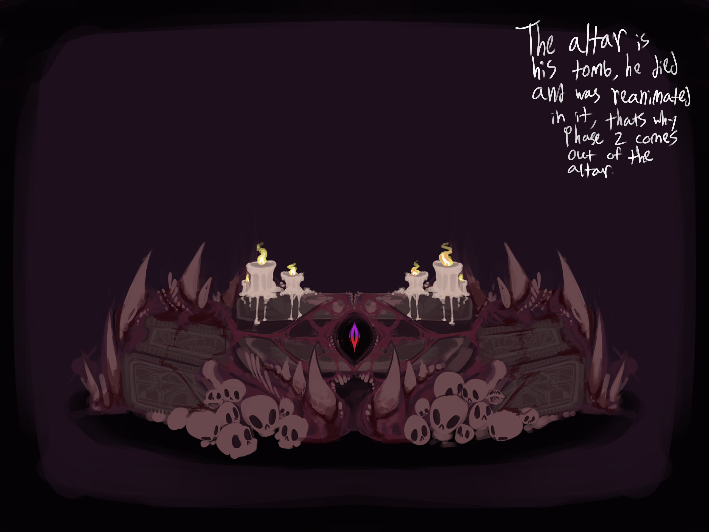
- 
- 
- 

## 攻击动作设计(10/15)
<video controls src="../Themed/Ravager/RavagerP2Attack1.mp4" title="Title"></video>
<video controls src="../Themed/Ravager/RavagerP2Attack2.mp4" title="Title"></video>
<video controls src="../Themed/Ravager/RavagerP2Attack3.mp4" title="Title"></video>
<video controls src="../Themed/Ravager/RavagerP2Attack4.mp4" title="Title"></video>
<video controls src="../Themed/Ravager/RavagerP2Attack5.mp4" title="Title"></video>
<video controls src="../Themed/Ravager/RavagerP2Attack6.mp4" title="Title"></video>
<video controls src="../Themed/Ravager/RavagerP2Attack7.mp4" title="Title"></video>
<video controls src="../Themed/Ravager/RavagerTwerking.mp4" title="Title"></video>

# VCVO
Heart Plus Up!主导的新官方附属VCVO(应当为Vanilla Calamity Visual Overhaul原版灾厄视效重做).将会对灾厄材质包提供支持,包括贴图,特效和其他内容

## CTP风格的机械Boss(10/9)
Heart Plus Up!公开了灾厄材质包风格的机械骷髅王和三子魔眼贴图
- 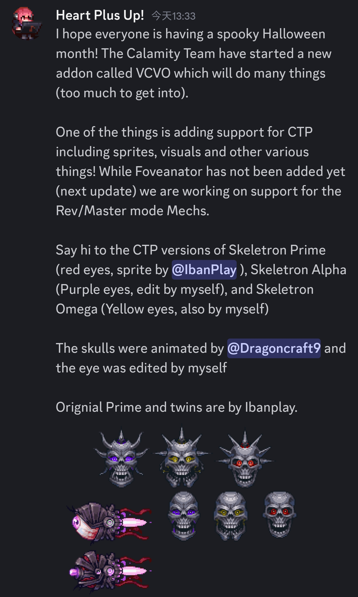
- 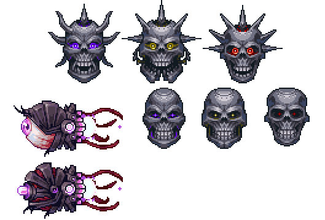

# 其他
- Triangle未来会给灾厄本体添加更多虚荣内容,其中他更倾向于大师模式特殊掉落(10/9)
  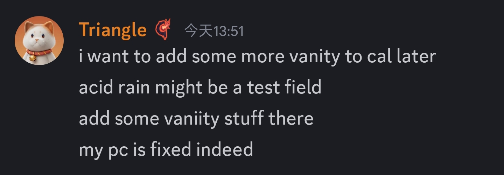
- Xyk称矿物史莱姆都会被其他矿物主题的敌怪取代(类似宝石爬虫的改动?)(10/13)
  

# 其他概念图
注意,这些概念图不一定是官方版本,很可能是C Mihaii的个人作品
- Cristian Mihaii的噬魂??概念图(10/17)
  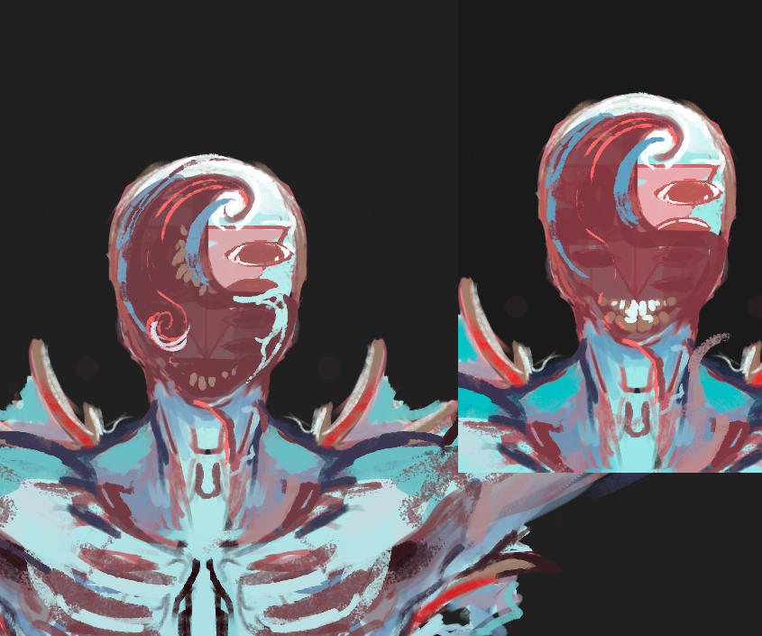
- Cristian Mihaii的极地之灵概念图(10/13)
  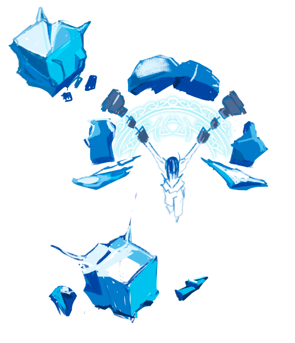
- Cirsitan Mihaii的硫磺火元素概念图(10/14)
  

# 更新相关
- 关于本月发布的首次击败肉山崩溃修复补丁,山猪表示"我们之前都不知道怎么修复它,直到最近有大手子出马"(10/17)
  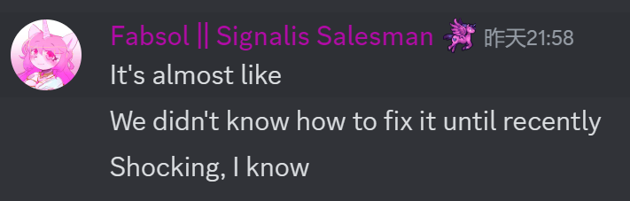
- 山猪说,在SSO发布前,可能还有一些bug修复补丁,11月份可能就有一个(10/17)
  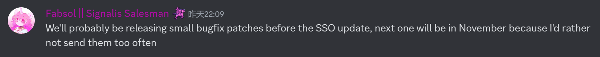