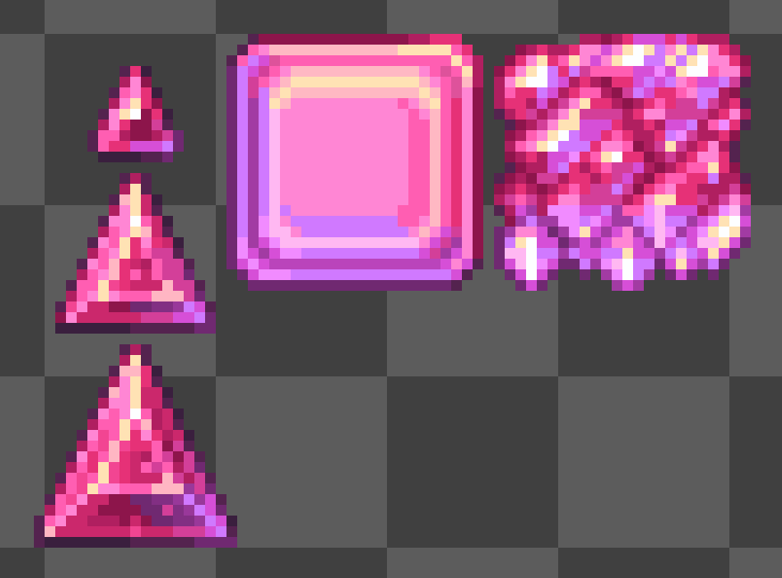
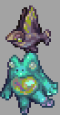

# 荒漠灾虫
- 三角可能会调整荒灾的脸部,质感和颜色(10/1)
  

# 菌生蟹
- Cristian Mihaii绘制的概念图(9/30)
  

# 村正竞赛
- 10月1日,Dia举办鬼妖村正竞赛,前5名作品将被加入游戏,竞赛到11月1日截止
  

# 不知道名字的群系
- 疑似更新(10/1)
  
  
  

# 图鉴
- YuH给生物图鉴中的蠕虫增加了动画(9/27)
  
  

# UI重新设计
- 玩家UI(9/19)
  

# 硫磺海生物
- Triangle的硫磺海生物(9/30)
  
- 天鳍鱼+腐蚀蛙的组合技(10/1)
  

## 酸雨
### (一阶)(10/2) ###
- 天鳍鱼:现在能够捡起辐核蟾蜍和酸水鳗加入战斗.被捡起的酸水鳗会从高空中射出射弹,狙击玩家;蟾蜍会被扔向玩家,进行地毯式轰炸
- 辐核蟾蜍:可能提升爆炸范围,造成更多伤害,可能留下滞留辐射圈.能被天鳍鱼捡起
- 酸水鳗: 现在类似归于,会得到彻底重做.三角的建议是让他们尝试跳出水面,吸在岸上的物块,并像炮台一样发射弹幕.如果玩家入水,它们会尝试撞击玩家.能被天鳍鱼捡起
- 辐射海蛞蝓:现有版本改成小动物.新的是一种辅助性地面敌怪,会产生一片强力辐射圈,强化附加敌怪并伤害玩家.
- 捣碎鳄: 现在是一阶酸雨的迷你Boss,在事件接近结束时声称.主要攻击为强力甩尾和螺旋冲刺(参考现实世界中鳄鱼的死亡旋转).它有能力将辐核蟾蜍甩向玩家,并呼唤其他敌怪来帮助他.
