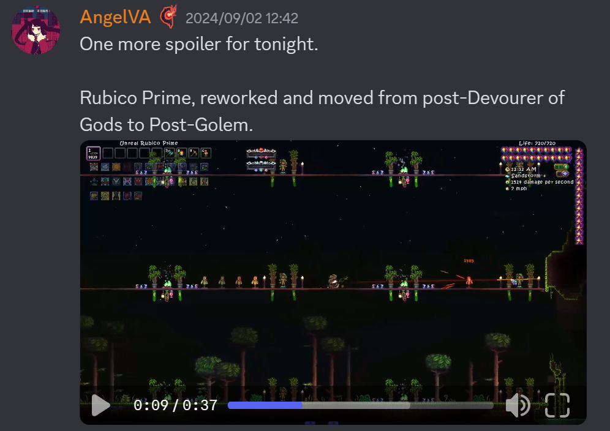
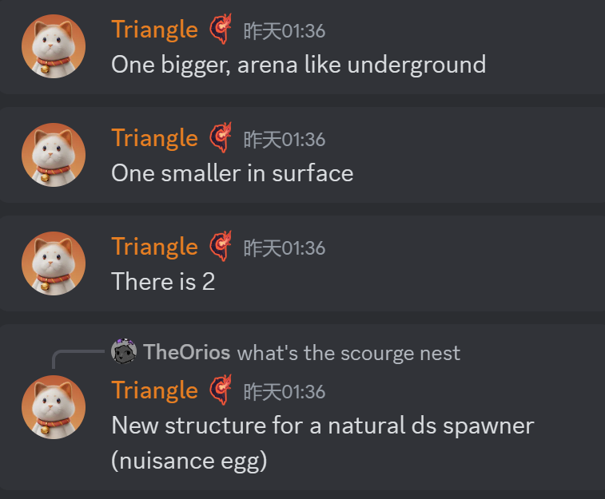
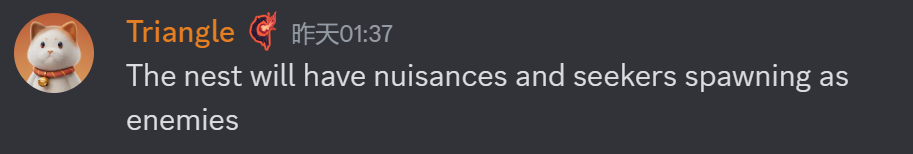
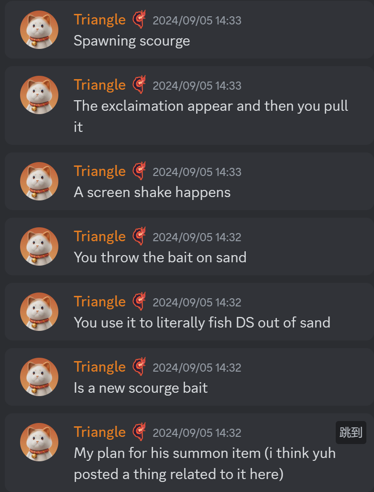
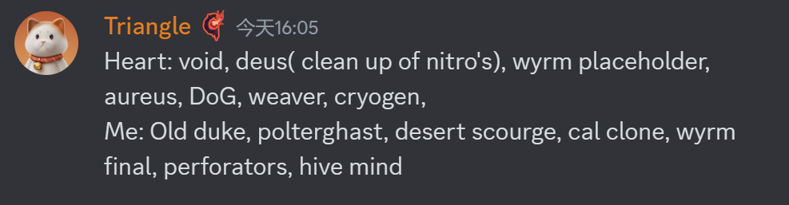
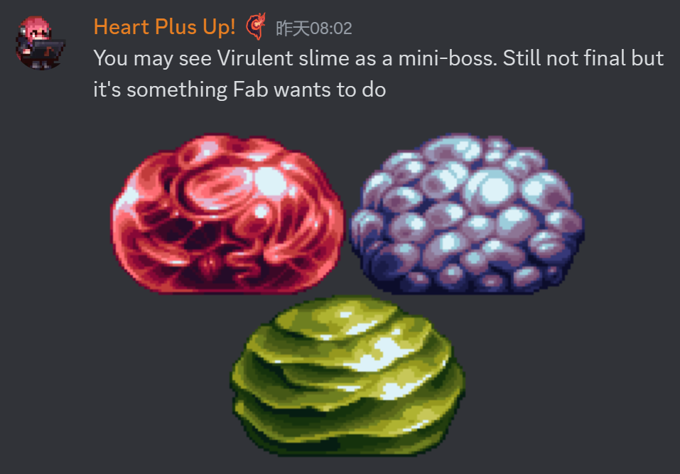
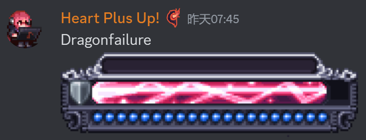

# 武器重做
- 衍曜旋刃(9/3)
  
- 空(9/3)
  将有两种攻击模式,长时间使用一种模式会降低攻速,强迫玩家交替使用攻击模式
  
- 泡沫冲锋枪(9/3)
  单纯视觉更改
  
- 绝路P(9/3)
  从神吞后移动到石巨人后
  

# Boss重绘
## 始源妖龙(9/3)
  
## 硫海遗爵
- (9/4)
  
- 老猪的设计参考,会给它日本龙的胡须等细节(因为它们都与天气控制相关)(9/4)
  
- 关于老猪的传说:老猪会更加接近龙(9/7)
  
  
  
- 希望老猪在GFB中有两倍大小(9/7)
  
- 老猪可能不会迎来彻底重做，更多的可能是视觉调整(9/7)
  
- 三阶段老猪会被大量核火焰烧化(9/5)
  

## 荒漠灾虫
- 新贴图(9/4)
  官号已经发布了"很酷的预告片"
  
- 将会有两个巢,充当荒灾的自然生成地点,一大一小(9/6)
  
- 首次进入地下巢时,会有荒灾吃yishi的演出(9/6)
  
- 灾虫住在沉沦海岸边,会阻止玩家深入海洋(9/6)
  
- 荒灾的无头盔版本,可能只能在血污中看到(9/6)
  
- 荒灾巢附近会生成小灾虫(Nuisance和Seeker分别指大小两种)(9/6)
  
- 荒灾的手动生成会改成字面意义上的钓起来(9/6)
  
- 三角可能再考虑一下荒灾的颜色(9/5)
  

## 神明吞噬者
- 二阶段贴图更新(9/3)
  

## 无尽虚空(9/3)
- 
## Heart和三角的Boss重绘分工(9/7)
  

# 其他NPC
- 剧毒史莱姆?(9/3)
  可能会是小boss
  
- ?
  
- 斯塔提斯现在是西格纳斯的奴隶,如果你战胜了西格纳斯,你将能够解救斯塔提斯
  

# UI重新设计(9/3)
- 队友条
  
- 魔力条
  
- 生命条
  
- 玩家UI
  
- Boss血条,每个Boss都有自己的血条
  + 女皇
    
  + 阿纳西塔和利维坦?
    
  + 白金星舰和星神游龙
    
  + 史神
    
  + 世纪小花
    
  + 石巨人
    
  + 痴愚金龙
    
  + 无尽虚空
    
  + 克眼
    

# 沉沦海

## 生物
- 每种小鱼有不同的游泳动画,已经放出一种(9/6)
  
  
- 海神Tyrian:会加入提到他的传说和(可能的)雕像(雕像是旧闻),以及一把武器(9/6)
  
  
- 沉沦海的部分内容将会变成卧龙海马锁而非荒灾锁(再次确认了卧龙海马MiniBoss的存在)(9/6)
  