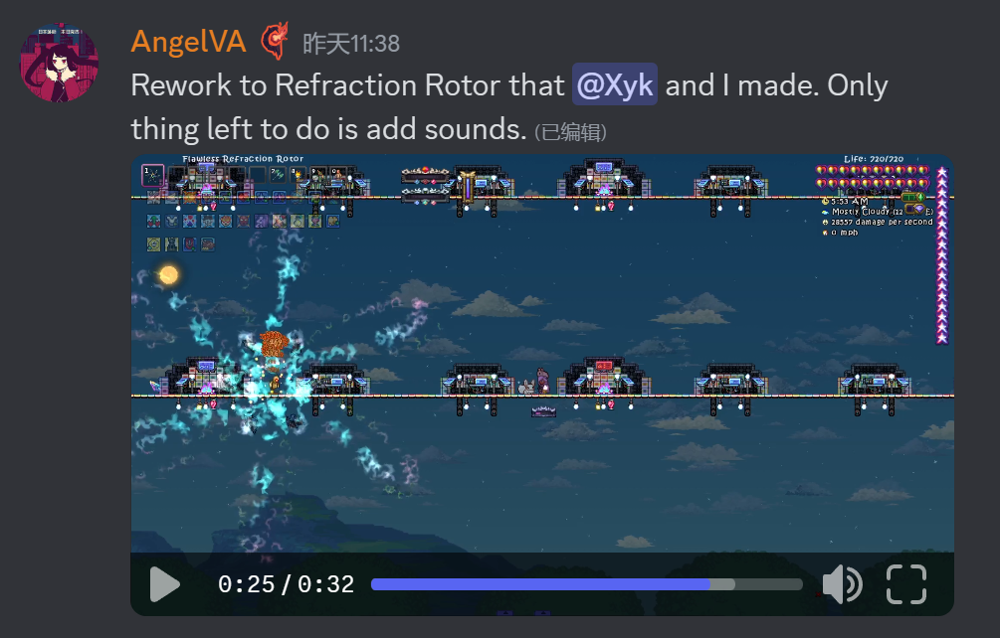
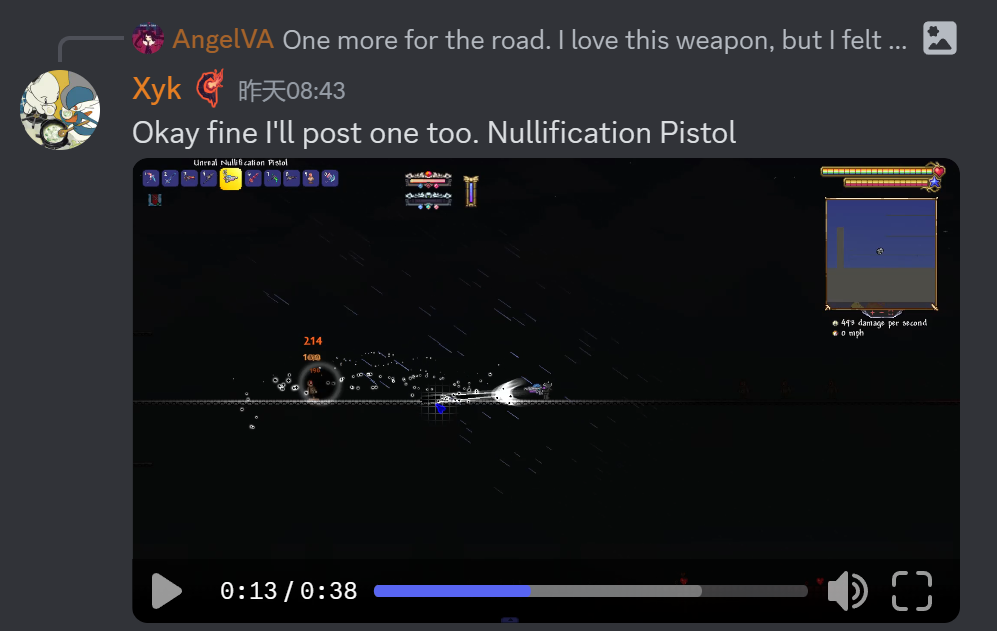
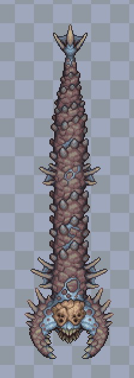
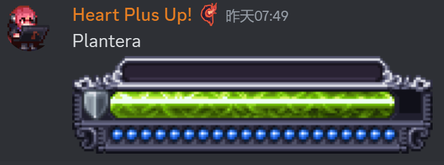

# 武器重做
- 衍曜旋刃(9/3)
  
- 空(9/3)
  将有两种攻击模式,长时间使用一种模式会降低攻速,强迫玩家交替使用攻击模式
  
- 泡沫冲锋枪(9/3)
  单纯视觉更改
  
- 绝路P(9/3)
  从神吞后移动到石巨人后
  

# Boss重绘
## 始源妖龙(9/3)
  
## 硫海遗爵
- (9/4)
  
- 老猪的设计参考,会给它日本龙的胡须等细节(因为它们都与天气控制相关)(9/4)
  

## 荒漠灾虫
- 新贴图(9/4)
  官号已经发布了"很酷的预告片"
  

## 神明吞噬者
- 二阶段贴图更新(9/3)
  

## 无尽虚空(9/3)
- 

# 其他NPC
- 剧毒史莱姆?(9/3)
  可能会是小boss
  
- ?
  

# UI重新设计(9/3)
- 队友条
  
- 魔力条
  
- 生命条
  
- 玩家UI
  
- Boss血条,每个Boss都有自己的血条
  + 女皇
    
  + 阿纳西塔和利维坦?
    
  + 白金星舰和星神游龙
    
  + 史神
    
  + 世纪小花
    
  + 石巨人
    
  + 痴愚金龙
    
  + 无尽虚空
    
  + 克眼
    