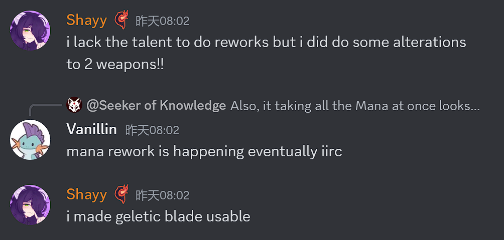
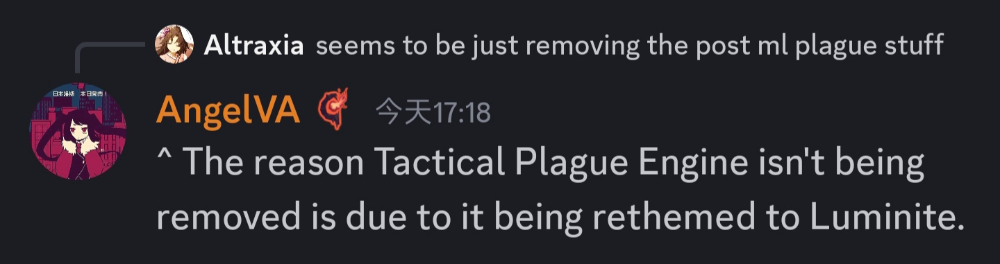
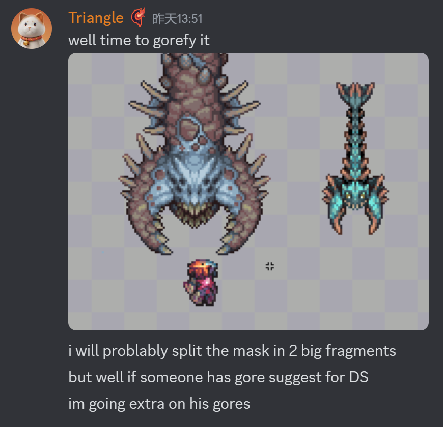
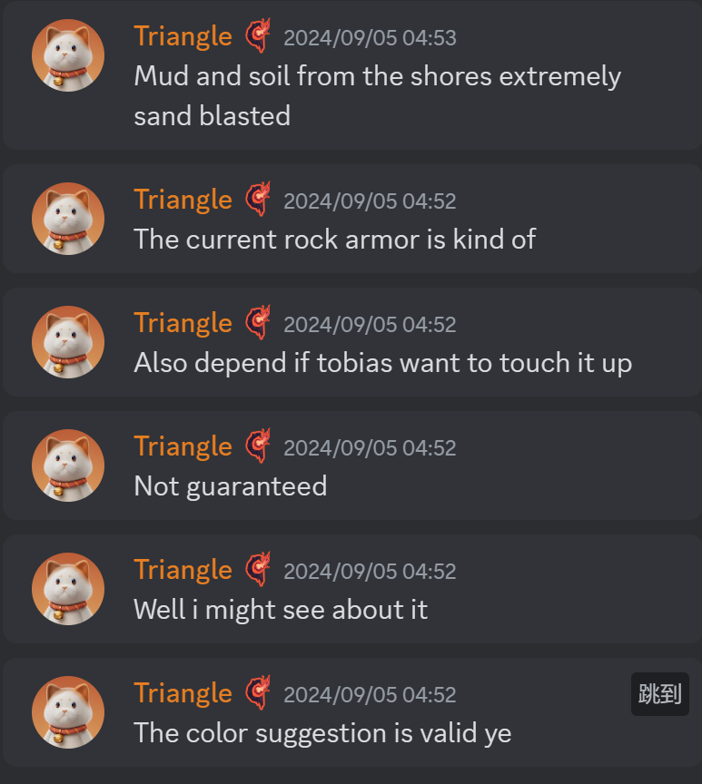
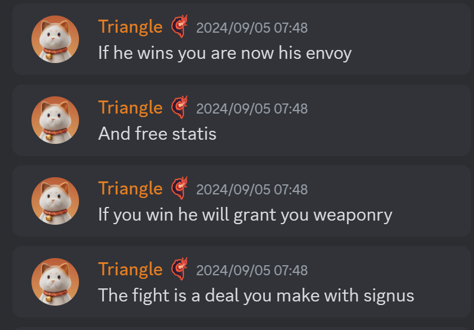
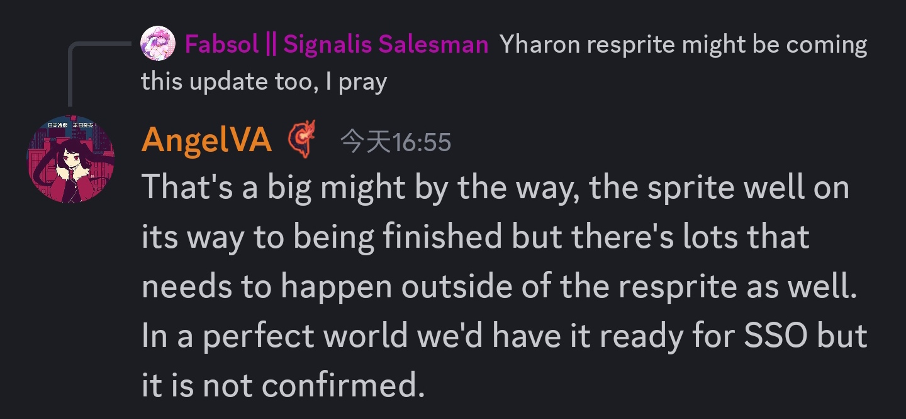
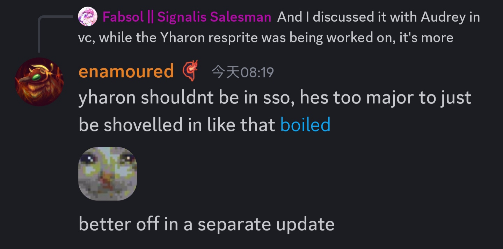
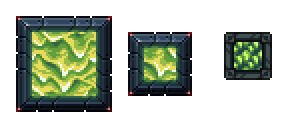

# 武器重做
- 衍曜旋刃(9/3)
  
- 空(9/3)
  将有两种攻击模式,长时间使用一种模式会降低攻速,强迫玩家交替使用攻击模式
  
- 泡沫冲锋枪(9/3)
  单纯视觉更改
  
- 绝路P(9/3)
  从神吞后移动到石巨人后
  
- 元素锯子(译名呢???)(9/6)
  
  
- 氦闪(9/7)
  
- 制裁大剑和携序之剑也被重做(暂无视频)(9/7)
  
- 凝胶波刃和梭鱼枪也被重做了(9/7)
  
  凝胶波刃的弹幕更大,更快,能穿透,Shayy认为它针对肉山很强(9/7)
  
  梭鱼枪现在有4或5个射弹,而且伤害更快,有一定偏移(旧闻:它已经被移到月后)(9/7)
  
- 鬼妖村正的贴图已经就位,Shayy计划做一个演示视频(注:Shayy是社交媒体的运营者,之前的预告片也是他做的)(9/7)
  
- 战术瘟疫引擎没有像其他月后瘟疫武器那样被移除,而是被重新设计为夜明系列(9/9)
  

# Boss重绘
## 始源妖龙(9/3)
  
## 硫海遗爵
- (9/11)
  
- 老猪的设计参考,会给它日本龙的胡须等细节(因为它们都与天气控制相关)(9/4)
  
- 关于老猪的传说:老猪会更加接近龙(9/7)
  
  
  
- 希望老猪在GFB中有两倍大小(9/7)
  
- 老猪可能不会迎来彻底重做，更多的可能是视觉调整(9/7)
  
- 老猪的二三阶段将有不同的贴图(9/9)  
  二阶段眼睛会有强烈的核辐射发光(和许多静脉射出来???)  
  三阶段头和翅膀会被硫磺(核?)火焰烧化  
  
- 未知剧透(9/9)
  
- 老猪的掉落物"猎龙者"系列将针对犽戎(9/11)  
  其中猎龙者套将会取代血炎盗贼套
  

## 荒漠灾虫
- 新贴图(9/4)
  官号已经发布了"很酷的预告片"
  
- 将会有两个巢,充当荒灾的自然生成地点,一大一小(9/6)
  
- 首次进入地下巢时,会有荒灾吃yishi的演出(9/6)
  
- 灾虫住在沉沦海岸边,会阻止玩家深入海洋(9/6)
  
- 荒灾的无头盔版本,可能只能在血污中看到(9/6)
  
- 荒灾巢附近会生成小灾虫(Nuisance和Seeker分别指大小两种)(9/6)
  
- 荒灾的手动生成会改成字面意义上的钓起来(9/6)
  
- 三角可能再考虑一下荒灾的颜色(9/5)
  

## 神明吞噬者
- 二阶段贴图更新(9/3)
  

## 无尽虚空(9/3)
- 
## Heart和三角的Boss重绘分工(9/7)
  

# 其他NPC
- 剧毒史莱姆?(9/3)
  可能会是小boss
  
- ?
  
- 斯塔提斯现在是西格纳斯的奴隶,如果你战胜了西格纳斯,你将能够解救斯塔提斯
  
- 克脑的那一堆减益会给GFB(9/9)
  
- 沉沦海更新除了沉沦海和荒漠灾虫之外,还会有史莱姆神,老猪,Foveanator的内容(9/8)
  
- 山猪也说犽戎重绘可能放出,但是不少开发者反对这一点(9/9)  
  AngelVA和Triangle认为进度还不够  
  
  
  enamoured(犽戎的动画师)认为不应当在这一次更新放出(主题不符等)  
  

# UI重新设计(9/3)
- 队友条
  
- 魔力条
  
- 生命条
  
- 玩家UI
  
- Boss血条,每个Boss都有自己的血条
  + 女皇
    
  + 阿纳西塔和利维坦?
    
  + 白金星舰和星神游龙
    
  + 史神
    
  + 世纪小花
    
  + 石巨人
    
  + 痴愚金龙
    
  + 无尽虚空
    
  + 克眼
    

# 沉沦海
- 沉沦海的大小大大增加了(9/7)
  
- 会包括一个"蛤区"和一个岩浆区(9/2)
  
- 群系生成和生物是进度最快的(9/11)
  

## 生物
- 每种小鱼有不同的游泳动画,已经放出一种(9/6)
  
  
- 海神Tyrian:会加入提到他的传说和(可能的)雕像(雕像是旧闻),以及一把武器(9/6)
  
  
- 沉沦海的部分内容将会变成卧龙海马锁而非荒灾锁(再次确认了卧龙海马MiniBoss的存在)(9/6)
  
- 会有一种三头海德拉,一个头射水矢,一个头射岩浆,一个头咬人.被水和岩浆射中会变成黑曜石,受到大量伤害.(9/2)
  
- 除了拾荒蟹以外的海岸生物:Mirage Newt(制造蜃气的蝾螈?) Pumper Prawn(超大肉食虾?)(9/2)
  

# 其他重绘
## 元灵之心
- Dia公布了元灵之心召唤的硫磺火元素和水元素(9/12)
    
  

## 瘟疫系列
- HPU公布了一部分瘟疫系列的重绘(9/4)
- 瘟疫密封砖
  
- 鼠疫弹
  
- 瘟疫细胞罐
  

# 盔甲重做
## 弑神者套
贴图:摸了,下次提到再找
- 弑神者冲刺会变成饰品(9/11)
  
  
## 军械库套装
- Triangle称军械库套装(疑似指一阶)已经接近做完,将在沉沦海更新中和其他一阶重做一起放出(9/12)
  

## 金源套

从左到右:法师,盗贼,召唤,战士,射手
- 金源套会有自己的技能而非下位的组合(9/11)
  
- 盗贼将有一个类似电磁炮的能力,加速武器并射出强大的闪电束
  
- 射手被动为龙型无人机,主动为巨大的火焰风暴
  

# 其他
- 计划给宇宙锭和金源锭设计工具(9/2)
  

# 花絮
- 开发者称卖玩偶的大部分收入都被厂家拿走了(9/13)
  
  