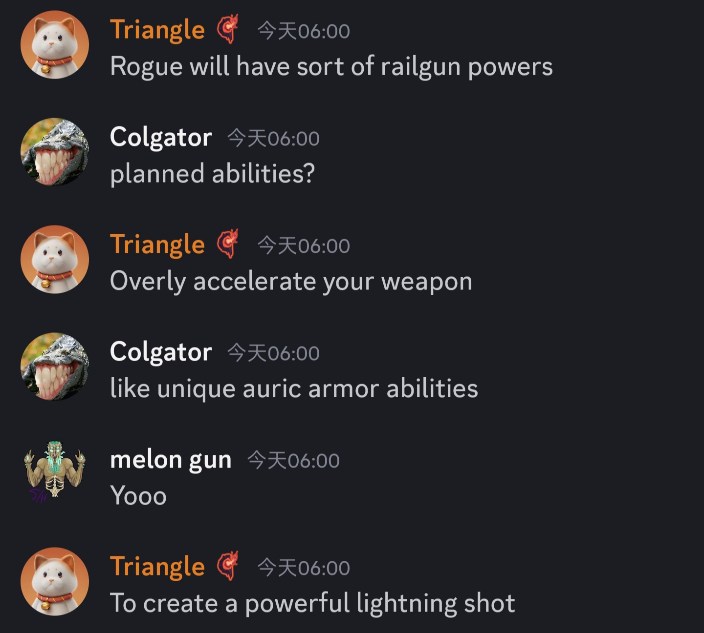
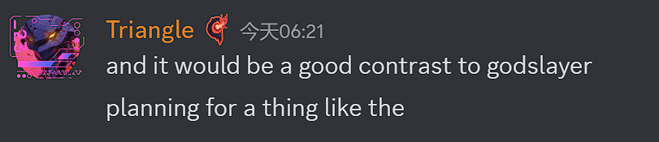
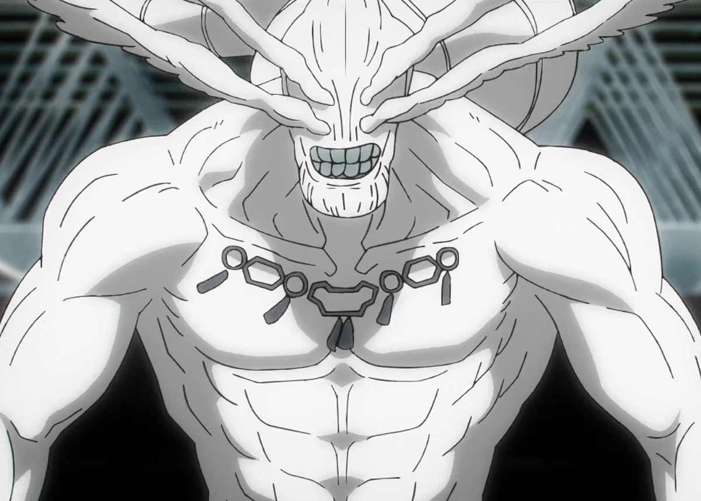
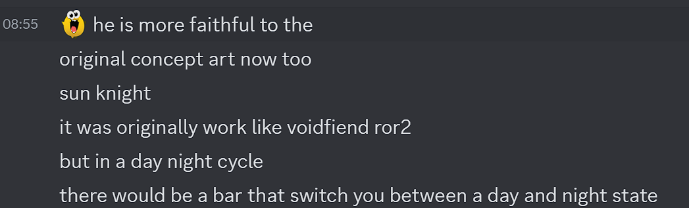
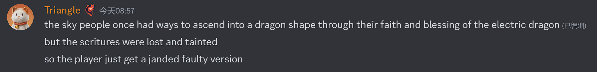
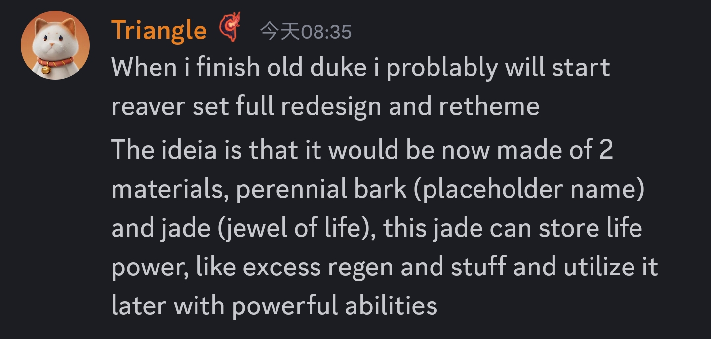

# General
- 金源套,弑神者套,天蓝套都有重做/重绘计划并且已经公布了新贴图(WIP)

## 弑神者套
贴图:摸了,下次提到再找
- 弑神者冲刺会变成饰品(9/11)
  

## 金源套

从左到右:法师,盗贼,召唤,战士,射手
- 金源套会有自己的技能而非下位的组合(9/11)
  
- 盗贼将有一个类似电磁炮的能力,加速武器并射出强大的闪电束
  
- 射手被动为龙型无人机,主动为巨大的火焰风暴
  

## 林海套
始源林海套,将不再像席尔瓦那样,而是有点像神(8/7)
  
  
  
  可能像老头环里的神皮二人组
  
  或者咒术回战的"八握剣異戒神将魔虚羅"
  
  ~~三角你学点好的吧...~~

## 天蓝套
疑似天蓝套新贴图(8/10)
请自行做阅读理解(我没看懂)

## 掠夺者套
Triangle称完成老猪后可能着手设计掠夺者套(9/18)(文字太多,文案如果要采用,请自行翻译,摸了)
