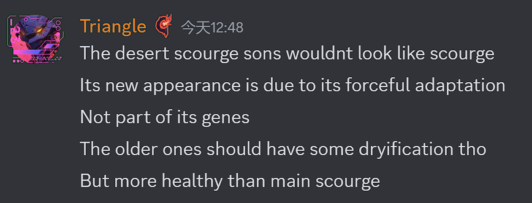
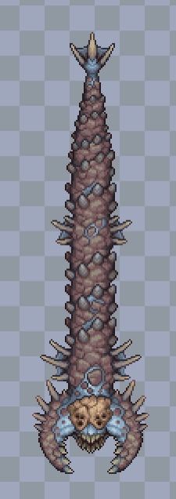
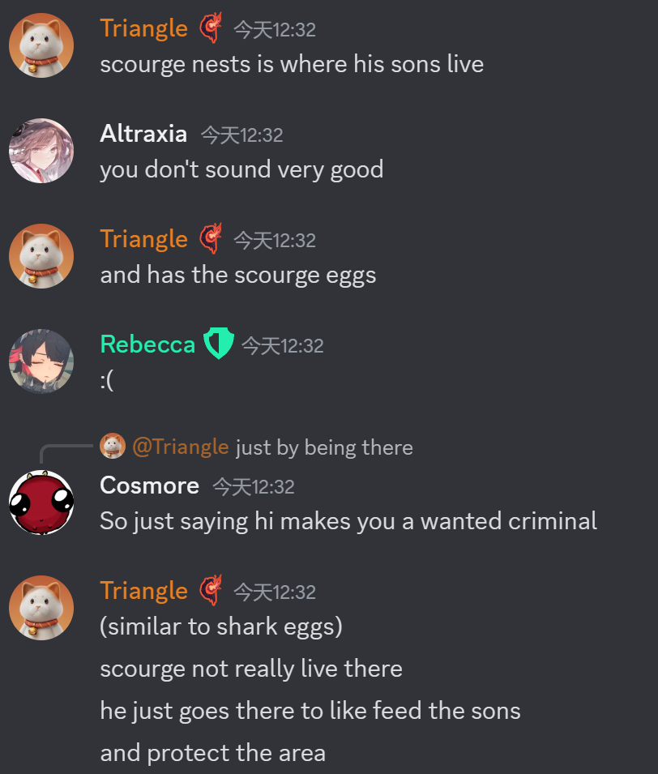
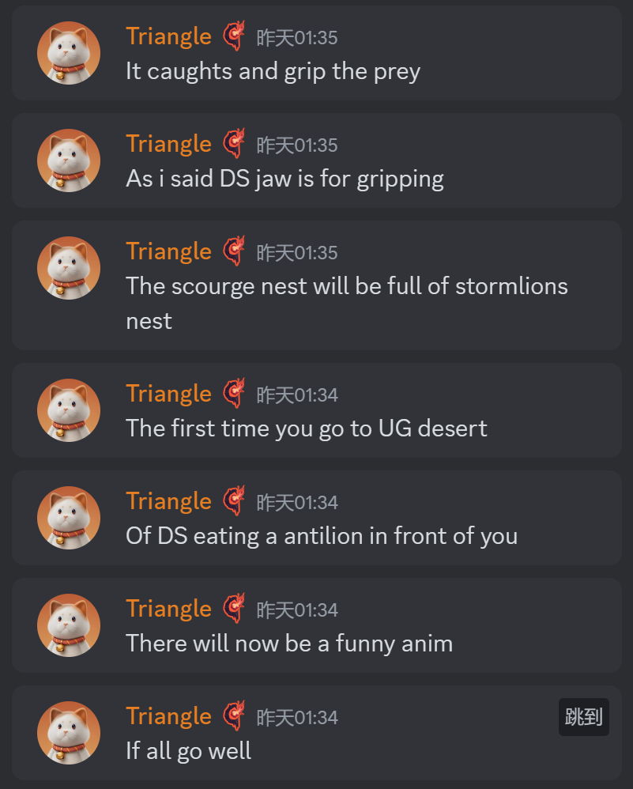
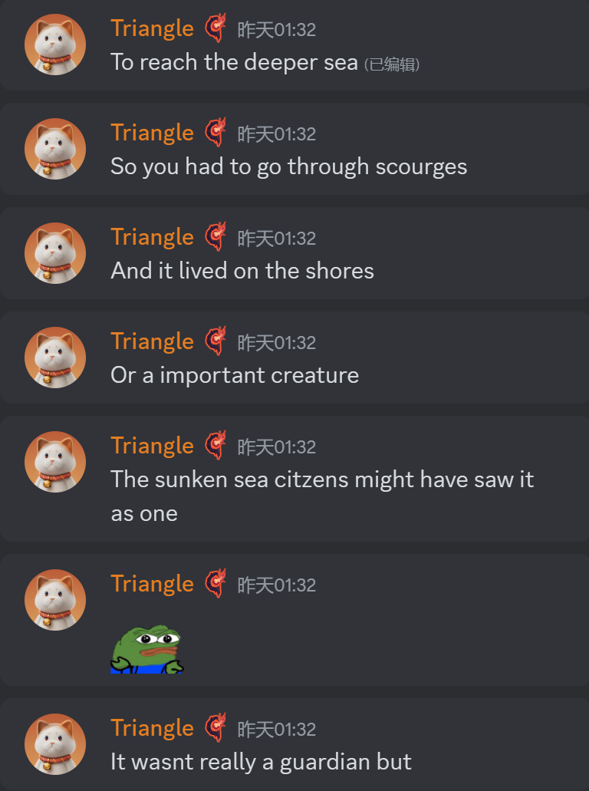
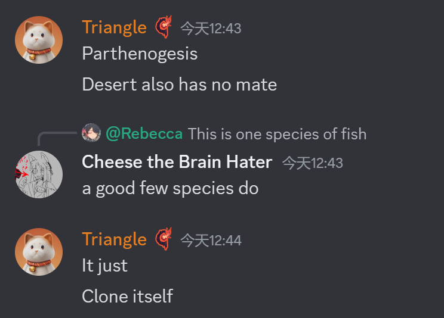
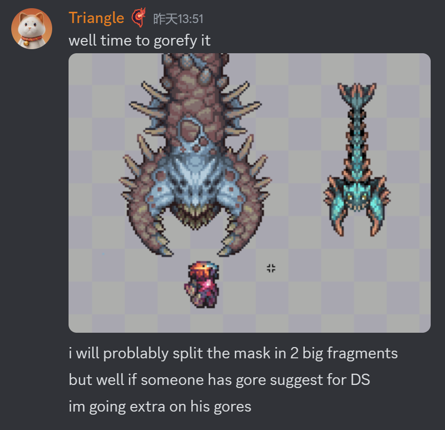
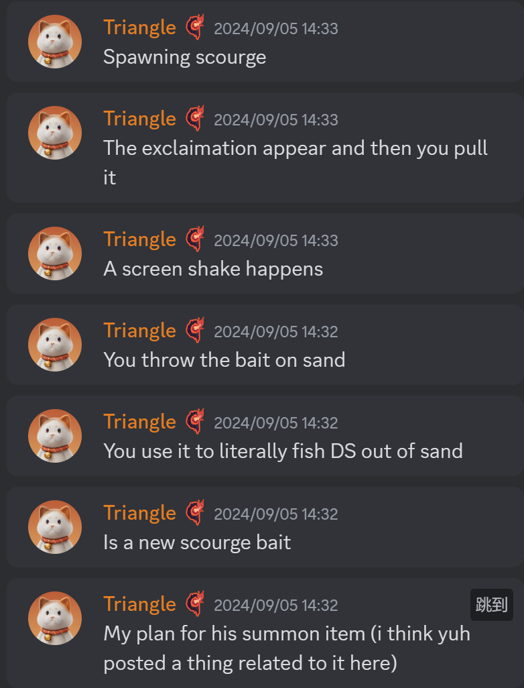
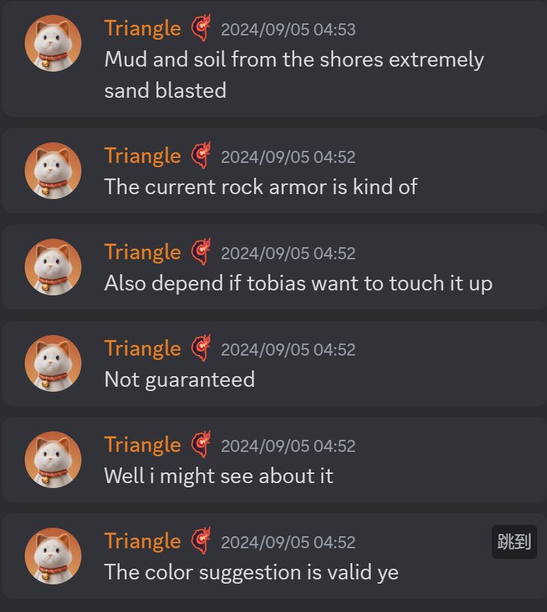

# 荒漠灾虫重绘
- 黄沙恶虫将不再像灾虫(8/13)
  
- 新贴图(9/4)
  官号已经发布了"很酷的预告片"
  
- 将会有两个巢,充当荒灾的自然生成地点,一大一小(9/6)
  
- 首次进入地下巢时,会有荒灾吃yishi的演出(9/6)
  
- 灾虫住在沉沦海岸边,会阻止玩家深入海洋(9/6)
  
- 通过自我复制来繁衍(8/20)
  
- 荒灾的无头盔版本,可能只能在血污中看到(9/6)
  
- 荒灾巢附近会生成小灾虫(Nuisance和Seeker分别指大小两种)(9/6)
  
- 荒灾的手动生成会改成字面意义上的钓起来(9/6)
  
- 三角可能再考虑一下荒灾的颜色(9/5)
  