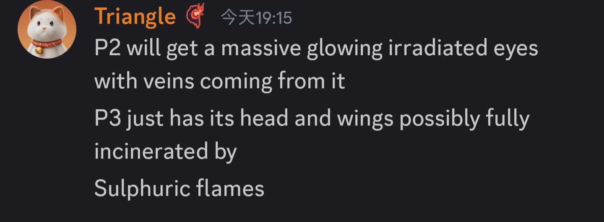
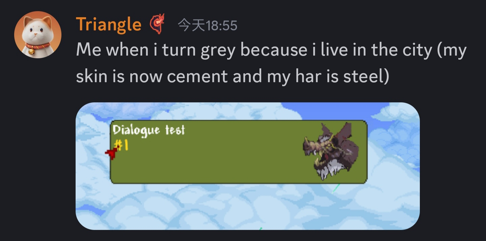

# General

- (9/14)
  
- 老猪的设计参考,会给它日本龙的胡须等细节(因为它们都与天气控制相关)(9/4)
  
- 关于老猪的传说:老猪会更加接近龙(9/7)
  
  
  
- 希望老猪在GFB中有两倍大小(9/7)
  
- 老猪可能不会迎来彻底重做，更多的可能是视觉调整(9/7)
  
- 老猪的二三阶段将有不同的贴图(9/9)  
  二阶段眼睛会有强烈的核辐射发光(和许多静脉射出来???)  
  三阶段头和翅膀会被硫磺(核?)火焰烧化  
  
- 未知剧透(9/9)
  
- 老猪的掉落物"猎龙者"系列将针对犽戎(9/11)  
  其中猎龙者套将会取代血炎盗贼套
  