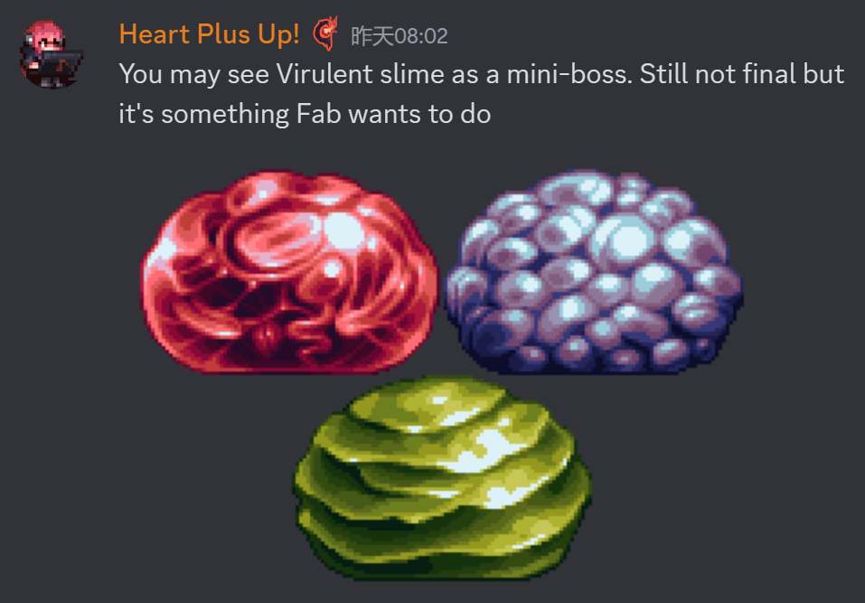
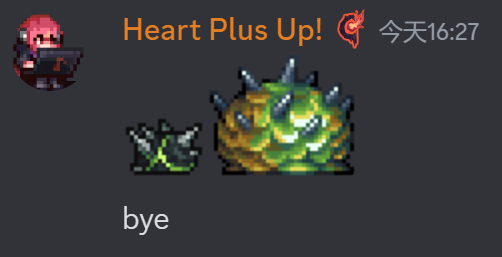
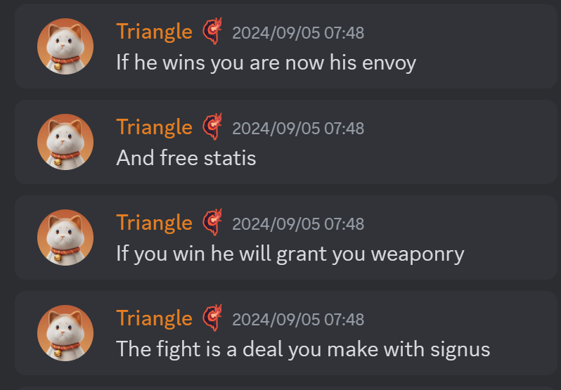
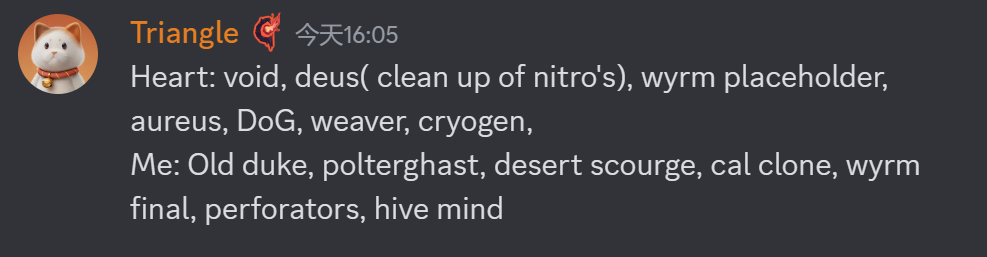
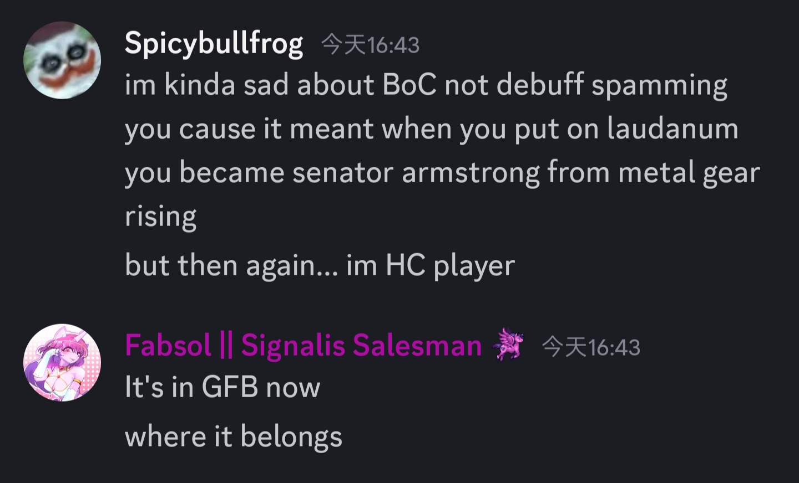
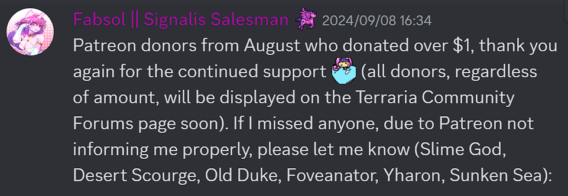
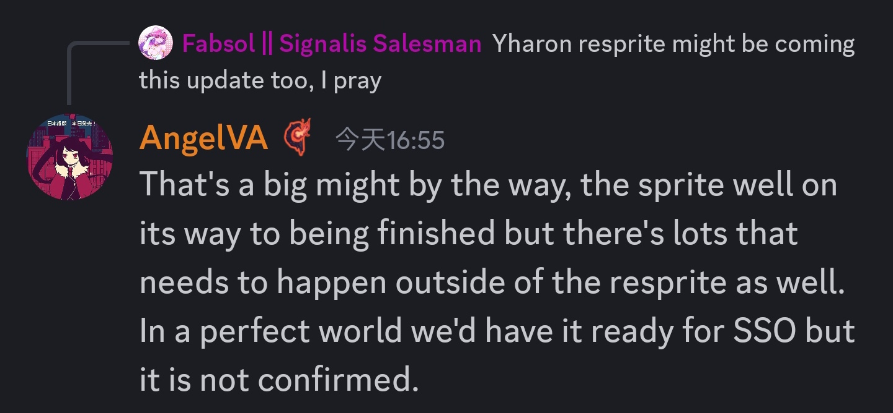
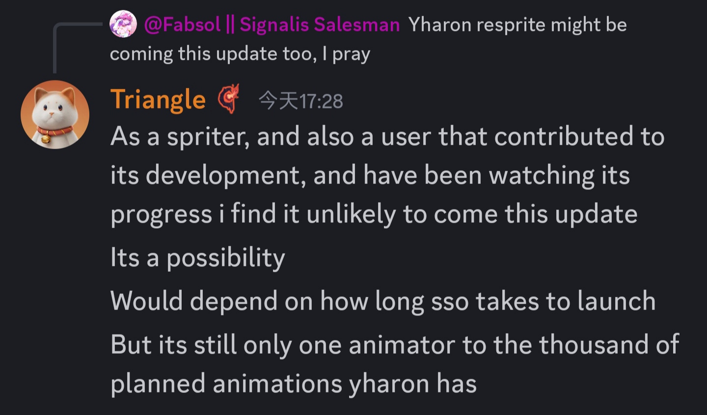
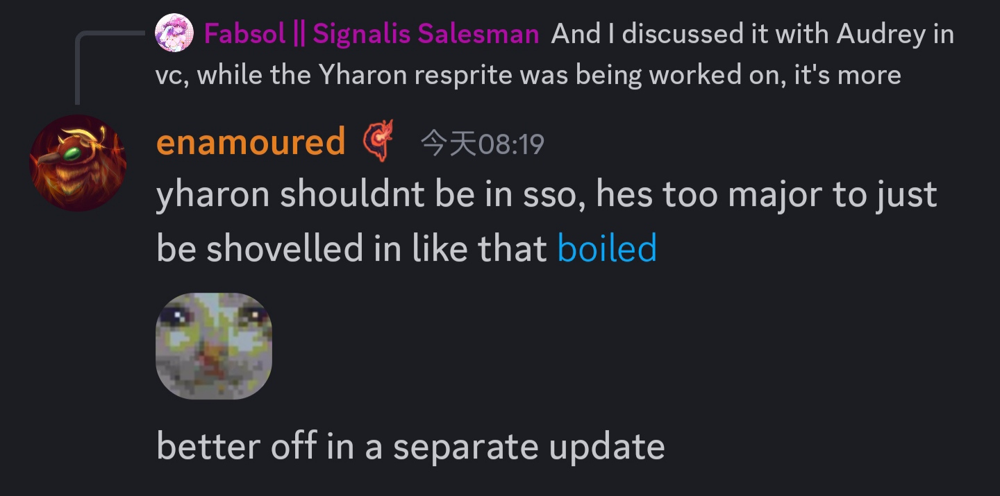
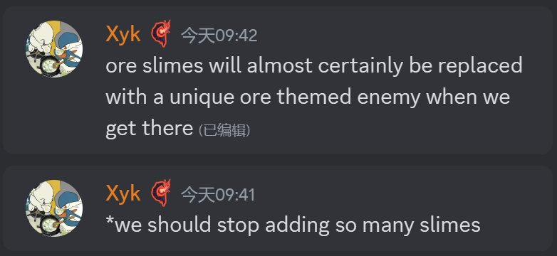

-  剧毒史莱姆?(9/3)
  可能会是小boss
  
- ?
  
- 斯塔提斯现在是西格纳斯的奴隶,如果你战胜了西格纳斯,你将能够解救斯塔提斯(9/6)
  
- Heart和三角的Boss重绘分工(9/7)
  
- 克脑的那一堆减益会给GFB(9/9)
  
- 沉沦海更新除了沉沦海和荒漠灾虫之外,还会有史莱姆神,老猪,Foveanator的内容(9/8)
  
- 山猪也说犽戎重绘可能放出,但是不少开发者反对这一点(9/9)  
  AngelVA和Triangle认为进度还不够  
  
  
  enamoured(犽戎的动画师)认为不应当在这一次更新放出(主题不符等)  
  
- Xyk称矿物史莱姆都会被其他矿物主题的敌怪取代(类似宝石爬虫的改动?)(10/13)
  