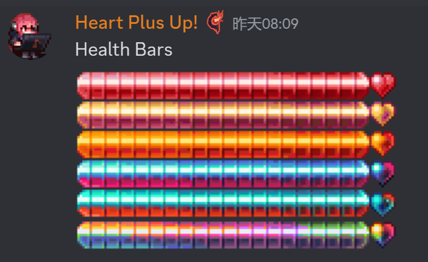
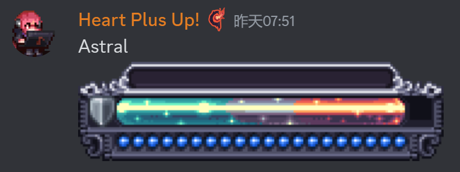

# 硫火崖优化
来自生物群系岩浆的作者Lion8cake
- 硫火崖的岩浆将得到渐变效果(8/5)
  <video controls src="CragsLava.mp4" title="Title"></video>
- 硫火崖会有岩浆泡,滴落岩浆等的新特效(8/6)
  

# 不知道名字的群系(8/26)

- 随世界生成

# 硫磺海新背景(9/3)

# UI重新设计(9/3)
- 队友条
  
- 魔力条
  
- 生命条
  
- 玩家UI
  
- Boss血条,每个Boss都有自己的血条
  + 女皇
    
  + 阿纳西塔和利维坦?
    
  + 白金星舰和星神游龙
    
  + 史神
    
  + 世纪小花
    
  + 石巨人
    
  + 痴愚金龙
    
  + 无尽虚空
    
  + 克眼
    