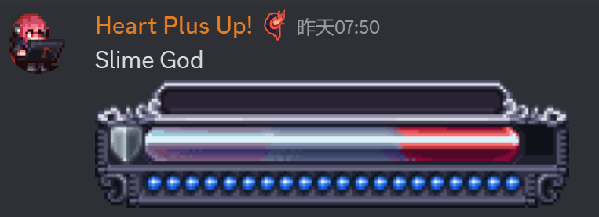
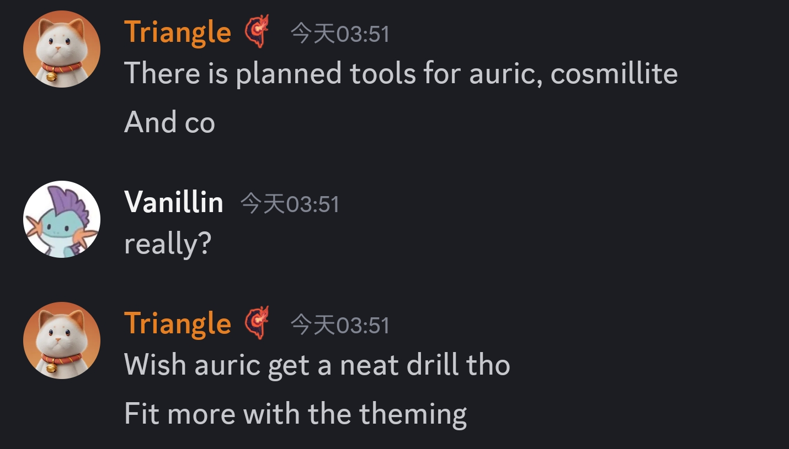
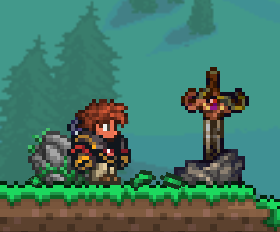

# 硫火崖优化
来自生物群系岩浆的作者Lion8cake
- 硫火崖的岩浆将得到渐变效果(8/5)
  <video controls src="CragsLava.mp4" title="Title"></video>
- 硫火崖会有岩浆泡,滴落岩浆等的新特效(8/6)
  

# 不知道名字的群系
- (8/26)
  随世界生成
- 疑似更新(10/1)
  
  
  
- Cristian绘制的相关概念图(10/3)
  
  

# UI重新设计(9/3)
- 队友条
  
- 魔力条
  
- 生命条
  
- 玩家UI(9/19)
  
- Boss血条,每个Boss都有自己的血条
  + 女皇
    
  + 阿纳西塔和利维坦?
    
  + 白金星舰和星神游龙
    
  + 史神
    
  + 世纪小花
    
  + 石巨人
    
  + 痴愚金龙
    
  + 无尽虚空
    
  + 克眼
    

# 图鉴
- YuH给生物图鉴中的蠕虫增加了动画(9/27)
  
  

# 工具
- 计划给宇宙锭和金源锭设计工具(9/2)
  

# 未知
- YuH对石约胜利之剑作了未知改动(10/8)
  

# 其他更新计划
- 沉沦海完成后可能会有永恒和亵渎迷你群落(9/21)
  
- Triangle未来会给灾厄本体添加更多虚荣内容,其中他更倾向于大师模式特殊掉落(10/9)
  
