# General
- 将是下一次主要更新,但是更新时间未知(七月已经提到了)
- 将会在沉沦海和沙漠之间加入新的过渡生物群系,以不死战士为主要敌人,目前被Triangle称作"the shores",下面采用这个称呼. 
- 将会有3个miniboss,包括重做后的巨像蛤,卧龙海马.*来源确认*
- 会彻底平衡召唤师职业,并且有新的鞭子和饰品. *来源确认*

# 大体进展
- 有3把新鞭子,以及摸了(8/14)
  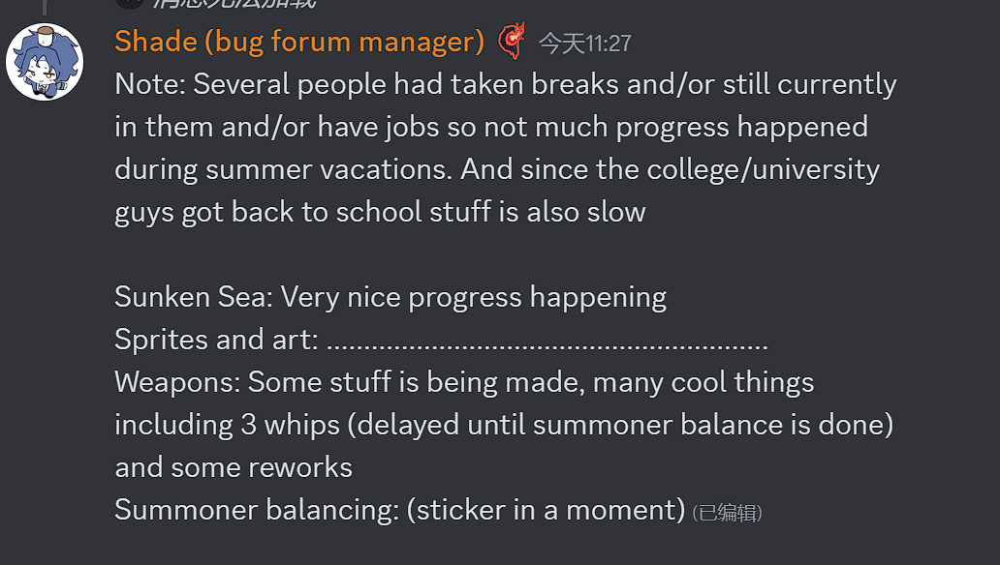
- 群系生成已经接近完成(8/8)
  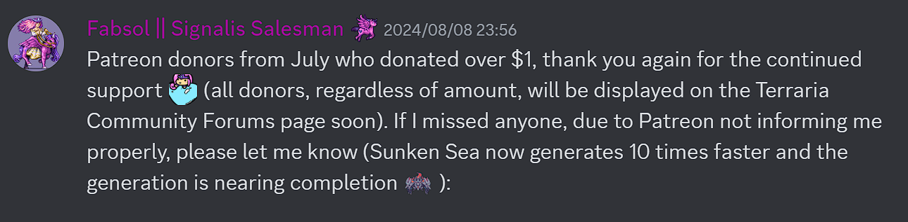

# 生物
概览图(8/20)
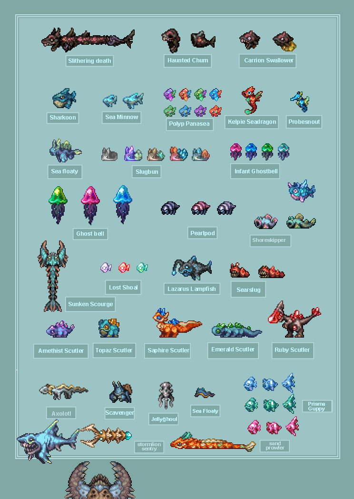
## 风暴蚁狮
- 风暴蚁狮将会有四种变种，分别对应四种蚁狮变种
  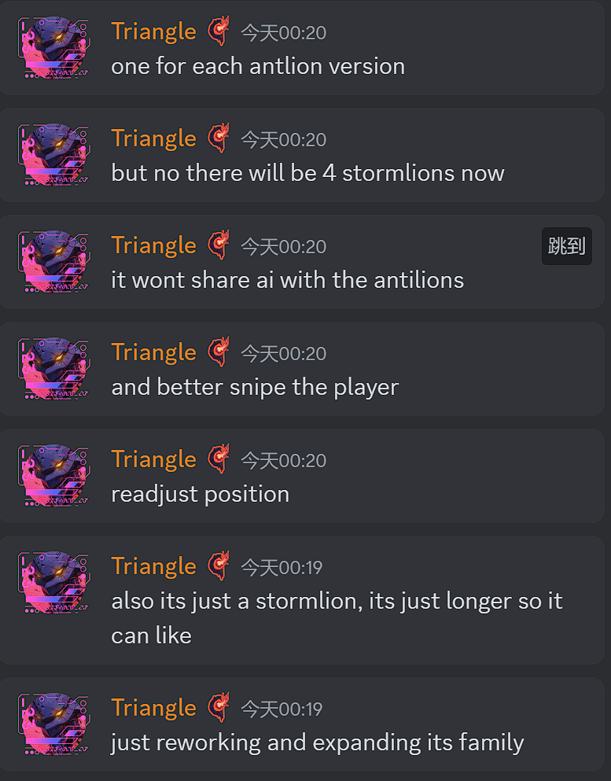
## 沉沦海生物
- 骸骨制的水母状生物将出现在the shores
  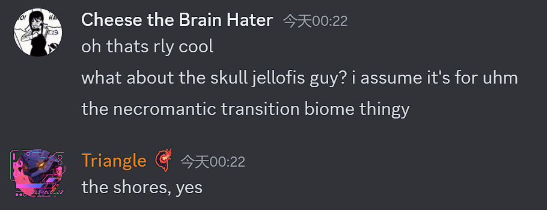
- 螃蟹商人/拾荒者,可用珍珠交换来自已死亡战士的战利品
  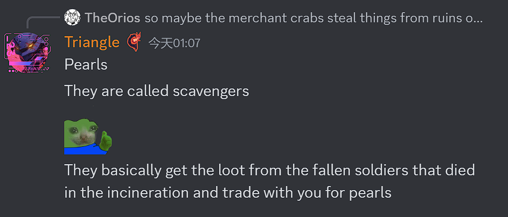
- 水母是在焚海事件死者的灵魂变的
  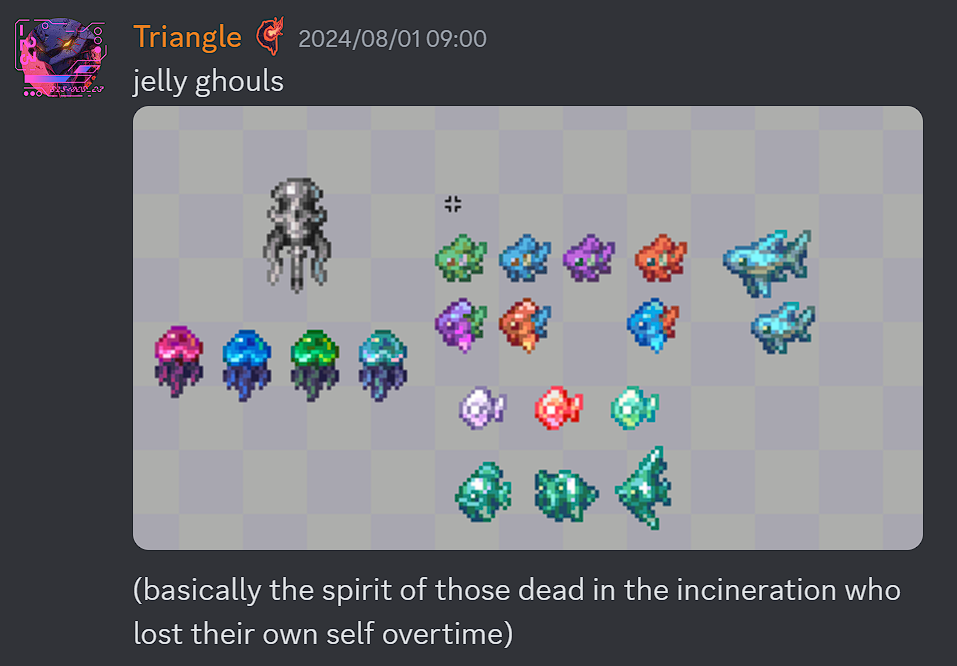
- 如果你冒犯遗体或墓碑,水母会被激怒并攻击你
  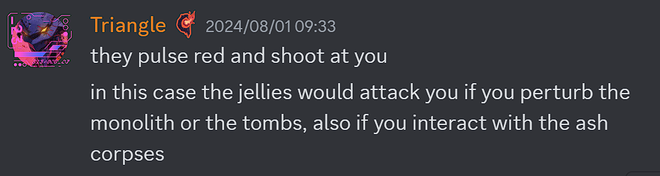
- 海兔有被动和攻击性两种
  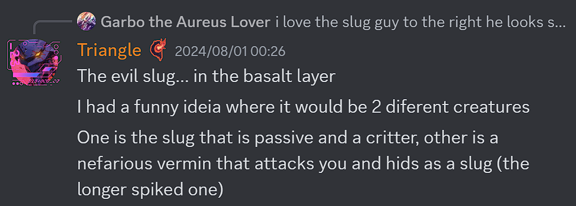
- 三种小鱼分别为:
  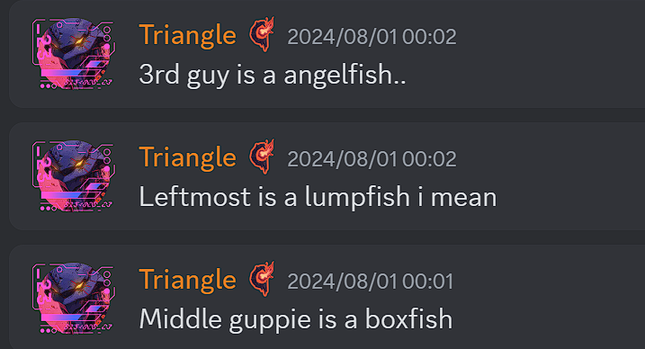
- 海蛞蝓重绘
  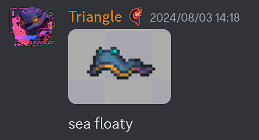

# 敌人
## 不死战士(the shores)
- 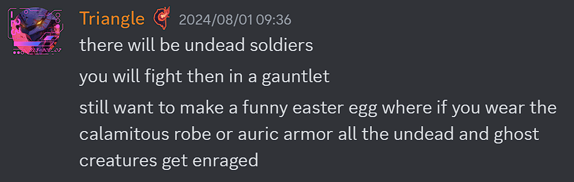
  可能加入穿戴灾厄长袍或金源套时激怒的彩蛋
- 是在焚海事件中阵亡的阿尔梅里斯士兵的遗体*来源确认*
- 有一张演示图*来源确认*
- 暂时还没有画的几种"大家伙":肉食虾,两种新的鲨,活着的菌生蟹(更小的变种),海德拉(8/6)
  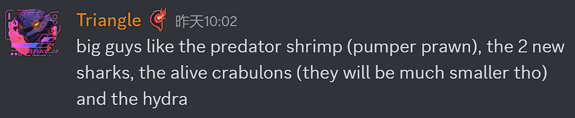
  
# 更新时间
- 可能今年内都不会出(准确度?它们自己都不一定知道)(8/7)
  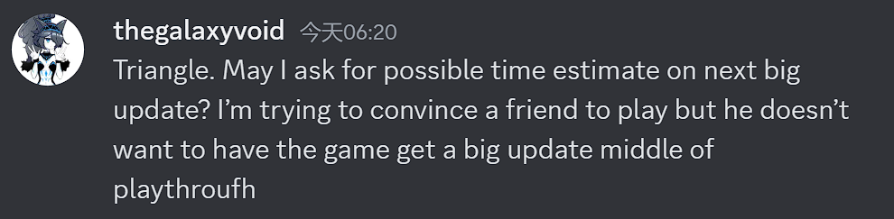
  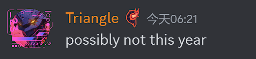
  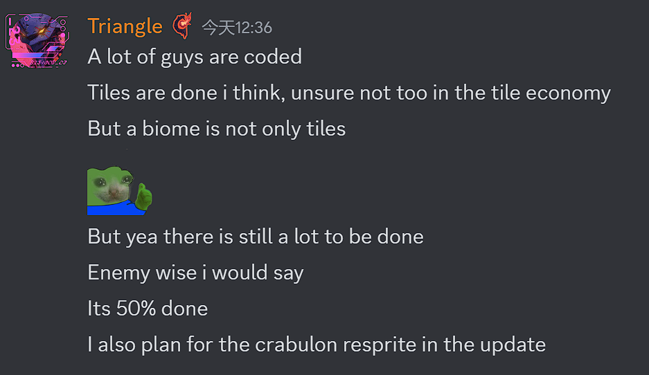(8/8)