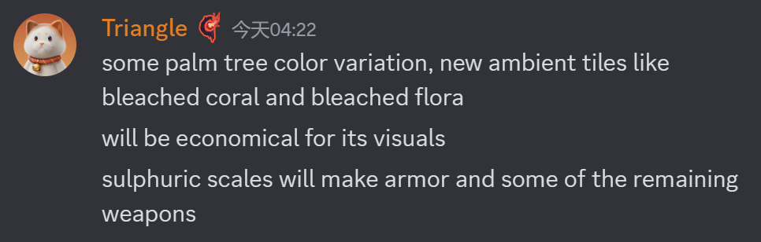
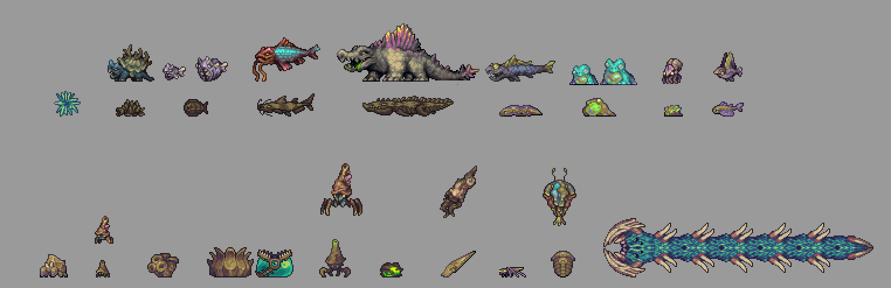
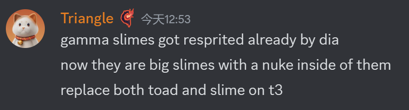
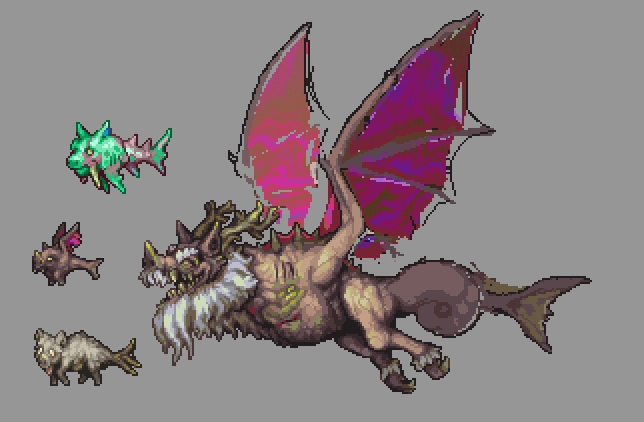

# General

## 硫磺海环境
- 新背景(9/3)

- 硫磺海会有棕榈树的颜色变种,新的环境物块,例如漂白的珊瑚和植物(10/3)
  

## 生物
- Triangle的硫磺海生物(9/30)
  
  (10/3)
- 天鳍鱼+腐蚀蛙的组合技(10/1)
  
- 会出现鹦鹉螺作为辅助敌怪,脑子将会成为可见部分(10/2)
  
- Gamma史莱姆由Dia重绘,会变成内部装有核弹的巨型史莱姆(10/3)
  
- 渊海灾虫可能是Dandy绘制,或者和三角合作(10/3)
  
- T1生物的武器(10/3)
  
- 老核弹一家,左下是新的硫磺猪龙(10/5)
  
- 包括硫磺猪龙,渊海狂鲨的概念图(10/6)
  
- 疑似酸水鳗(10/7)
  
- 高口蟹动图(10/7)
  
- 酸雨1阶部分小怪(10/6)
  

## 酸雨
### 一阶(10/2) ###
- 天鳍鱼:现在能够捡起辐核蟾蜍和酸水鳗加入战斗.被捡起的酸水鳗会从高空中射出射弹,狙击玩家;蟾蜍会被扔向玩家,进行地毯式轰炸
- 辐核蟾蜍:可能提升爆炸范围,造成更多伤害,可能留下滞留辐射圈.能被天鳍鱼捡起
- 酸水鳗: 改名为salmonstrosities(鲑鱼?),会得到彻底重做.三角的建议是让他们尝试跳出水面,吸在岸上的物块,并像炮台一样发射弹幕.如果玩家入水,它们会尝试撞击玩家.能被天鳍鱼捡起
- 辐射海蛞蝓:现有版本改成小动物.新的是一种辅助性地面敌怪,会产生一片强力辐射圈,强化附加敌怪并伤害玩家.
- 捣碎鳄: 现在是一阶酸雨的迷你Boss,在事件接近结束时声称.主要攻击为强力甩尾和螺旋冲刺(参考现实世界中鳄鱼的死亡旋转).它有能力将辐核蟾蜍甩向玩家,并呼唤其他敌怪来帮助他.

### 二阶(10/3) ###
- 事件变化:雨越下越大了,现在雷暴清晰可见,而且偶尔会落在玩家身上,造成巨大威胁!salmonstrosities和天鳍鱼不再生成,捣碎鳄现在在事件的前40%作为迷你Boss生成,在后期被峭咽潭取代,辐核蟾蜍和鹦鹉螺也在二阶出现 
- Troglobite(疑似原三叶虫): 支援坦克敌怪,会尝试跳入其他敌怪体内,寄生于他们身上,被寄生的敌怪会得到高额防御,以及受击时用刺反击的能力.做出更改的原因是水下敌怪的生态位已经有直角石了,且现在的事件中还没有坦克位.
- 直角石: 水下杀手,会蓄力冲刺,并用它锥形的头部刺穿玩家.如果玩家出水,它会向玩家发射酸性墨水弹,而不是什么都不做. 
- 硫海爬虫: 它的泡泡形态将会有新的移动模式,使它多是空军单位(它在飞行气泡模式下会更清晰).它也能向辐核蟾蜍和直角石发射泡泡,并让它们浮在空中.飞起来的辐核蟾蜍将会是更大的空中威胁,用以针对已经获取了翅膀的玩家.(泡泡直角石还不一定,但三角认为考虑到翅膀的移动力,上述的飞行蟾蜍设计很棒)
- 辐射史莱姆: 主要地面威胁,跳跃时在地上留下飞溅酸液滴,能够伤害玩家,并引爆辐核蟾蜍
- 高口蟹: 主要射弹敌怪,在远处就位并狙击玩家.是高优先度敌人,因为它们一旦聚集起来,将变得很难处理.它存在的主要目的是阻止玩家在事件期间站定不动,并保持玩家高度警惕(它和雨中冒险2中的螃蟹定位类似)
- 峭咽潭: 行为不变,视觉更改(如果二阶酸雨中就有二阶段会更好).计划将它的设计更改为一个超大型变异阿米巴虫(考虑到Dia的Gamma史莱姆设计).三角的主要建议是优化它的钩子,使它捕兽夹一样的嘴能够实际工作,并在玩家过于靠近或者被钩子推动时夹住玩家.最后,希望它能够把其他敌怪拉过来辅助它.作为迷你Boss,在事件的后半段生成. 

### 三阶(10/4) ###
- 事件变化: 雷击不再仅仅是环境,而是真正的威胁
- Anomaly(异常): 替代直角石,受到奇虾的启发.在水中极其快,如果玩家在水中,会尝试猛击玩家.如果玩家在攻击范围外,它会将侧鳍作为追踪弹幕发射出去.如果玩家在它正上方,它会冲出水面.
- Radiodactyl(辐射翼龙): 替代天鳍鱼,主要攻击是像俯冲炸弹一样冲向玩家,尝试用它带刺的喙刺穿玩家.另一种攻击为向玩家丢出酸性炸"蛋".也能携带Anomalies,核弹史莱姆和辐射海蛞蝓.
- Dreadgnaw(恐噬邓甲): 替代Troglobite,受到邓氏鱼启发.有一个极其坚韧的甲壳,需要先打碎甲壳才能对他造成伤害.它能够将水下敌人击飞到岸上.
- Nuclear Slime(辐核史莱姆): 结合辐核蟾蜍和辐射史莱姆,生成非常稀少.生成时就自带倒计时和警报声,必须被快速解决.倒计时归零时爆炸,爆炸范围很大,伤害极高,并会留下能够强化其他敌人的滞留圈.
- Sulphron(硫磺猪龙): 替代硫海爬虫.一种低级猪龙变种.
- 渊海狂鲨: 未完成
- 辐核骇兽: 未完成