# General
基本上asfl都会搬运
- 劳模Xyk自从小南瓜更新后,已经制作了32个重做了
  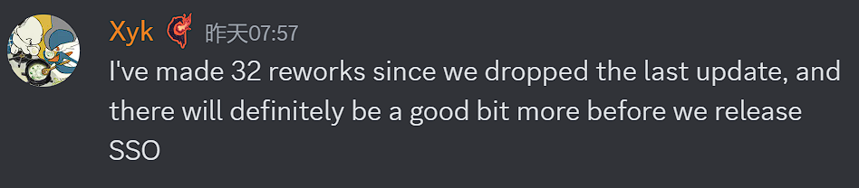

- 衍曜旋刃(9/3)
  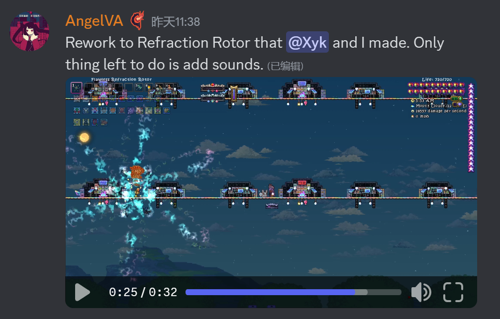
- 空(9/3)
  将有两种攻击模式,长时间使用一种模式会降低攻速,强迫玩家交替使用攻击模式
  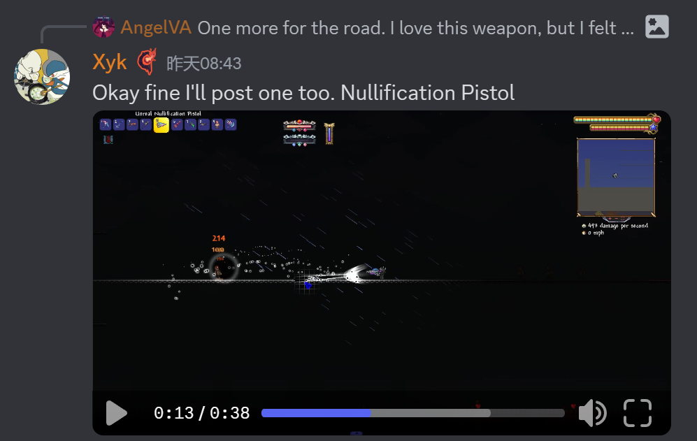
- 泡沫冲锋枪(9/3)
  单纯视觉更改
  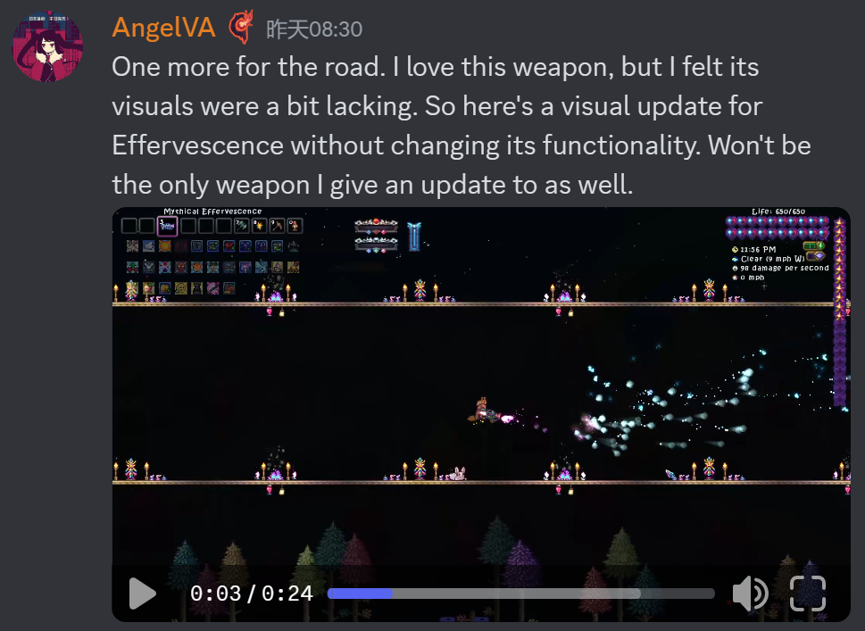
- 绝路P(9/3)
  从神吞后移动到石巨人后
  
- 元素锯子(译名呢???)(9/6)
  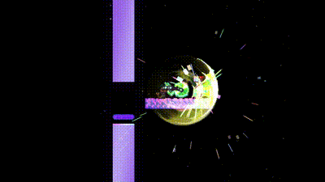
  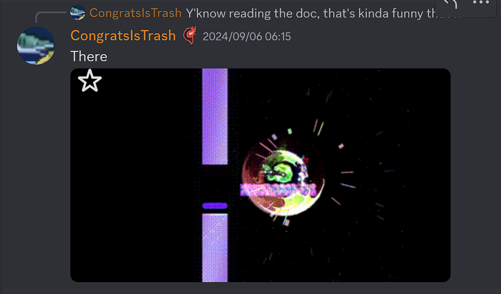
- 氦闪(9/7)
  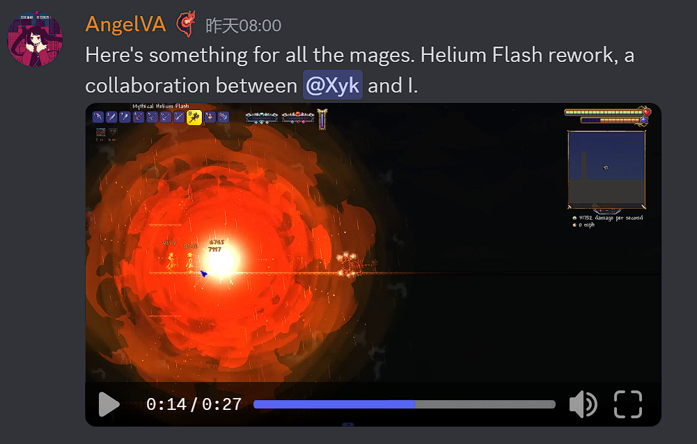
- 制裁大剑和携序之剑也被重做(但是暂无视频)(9/7)
  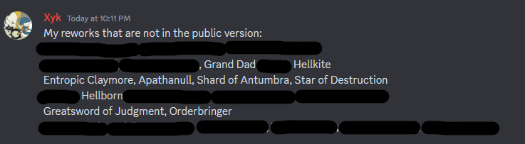
- 凝胶波刃和梭鱼枪也被重做了(9/7)
  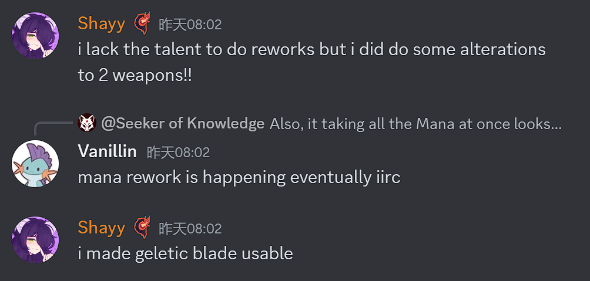
  凝胶波刃的弹幕更大,更快,能穿透,Shayy认为它针对肉山很强(9/7)
  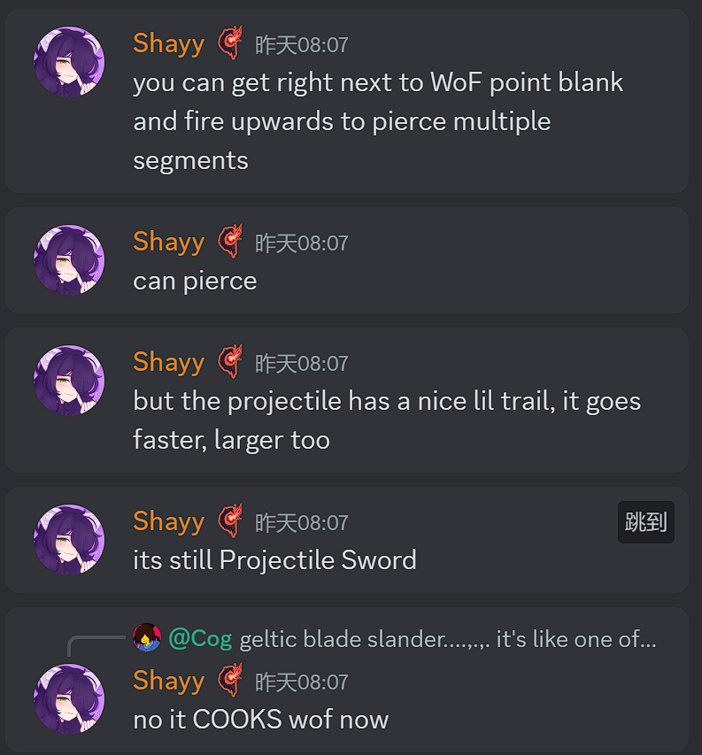
  梭鱼枪现在有4或5个射弹,而且伤害更快,有一定偏移(旧闻:它已经被移到月后)(9/7)
  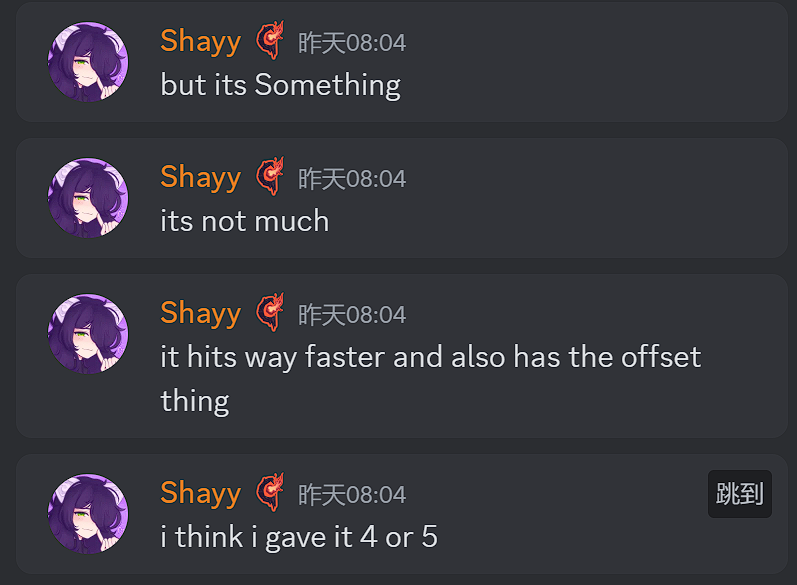
- 鬼妖村正的贴图已经就位,Shayy计划做一个演示视频(注:Shayy是社交媒体的运营者,之前的预告片也是他做的)(9/7)
  
- Dia对鬼妖村正的开发者专属贴图做了更新(9/15)
  
- 战术瘟疫引擎没有像其他月后瘟疫武器那样被移除,而是被重新设计为夜明系列(9/9)
  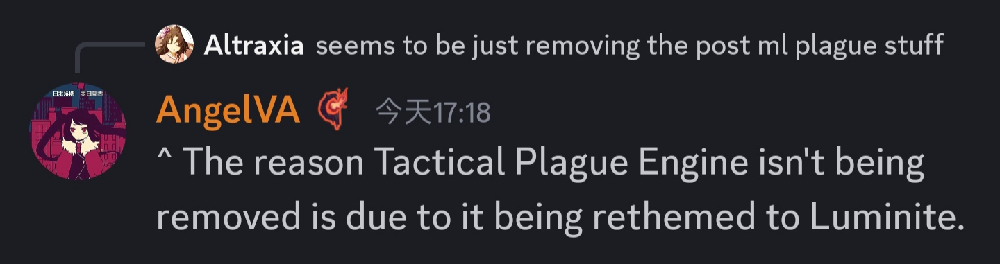
- Xyk近期可能着手磁极异变(9/21)
  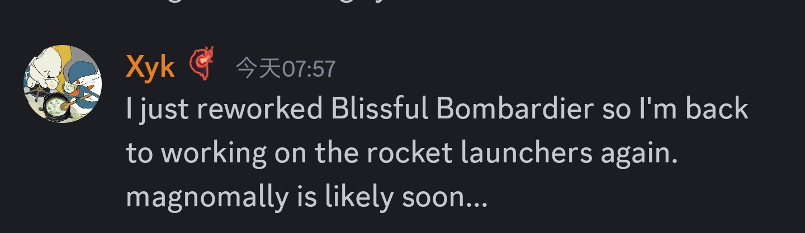
- 再之后可能着手星神之杀和耀界之光(9/21)
  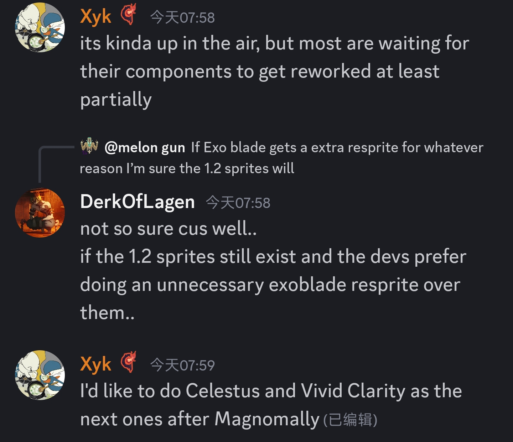